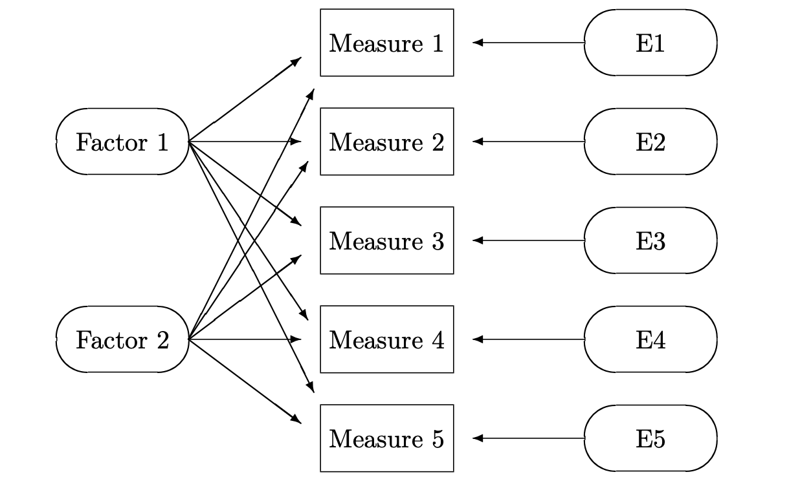
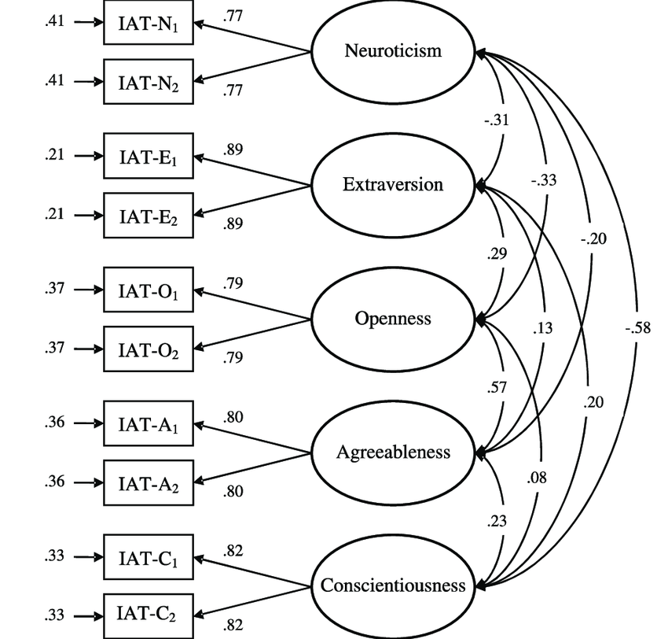
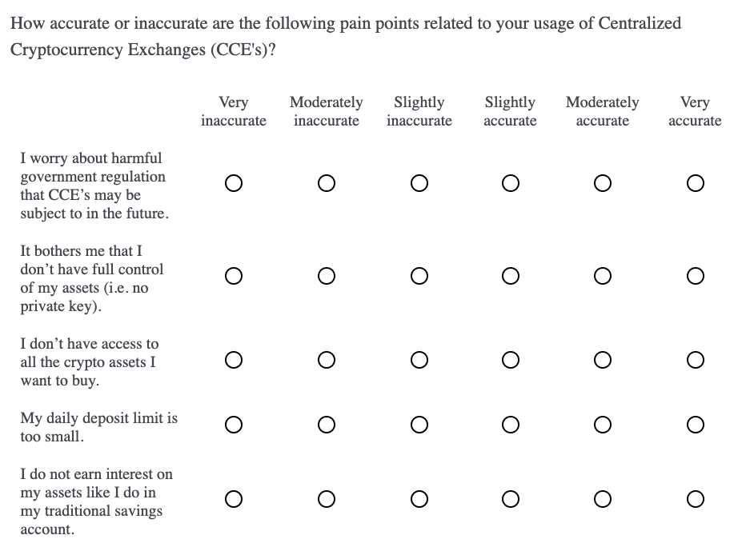

# Reveal patterns among user needs with Factor Analysis {#Project1}

```{r 01.0, include = FALSE}
knitr::opts_chunk$set(echo = TRUE)

library(psych)
library(psychTools)
library(corrplot)
library(nFactors)
library(GPArotation)
library(semPlot)
library(gplots)
library(RColorBrewer)

dat <- na.omit(read.csv("./data/01_dat.csv", header = TRUE))
key <- read.csv("./data/01_key.csv", header = FALSE)[,1]
```

Exploratory Factor Analysis (EFA) seeks to reveal hidden constructs in our data and is based on the "Common Factors Model" shown below [@decoster_overview_1998].

<br>
<center>
{width=70%}
</center>
<br>

The basic idea is that we can capture direct measures of things like user attitudes and behaviors, and these measures are influenced by underlying "factors", or latent variables, that we cannot directly measure [@qualtrics_factor_2020]. The field of psychology made use of EFA in establishing its Big Five Personality Theory - that there exist five dimensions on which personalities vary across individuals in the population [@srivastava_big-five_1999]. 

<br>
<center>
{width=70%}
</center>
<br>

Here, the factors are the five personality dimensions. We cannot directly measure something abstract like extraversion, but we can show respondents attitudinal statements and capture agree/disagree ratings for each. These statements might be:

<br>

**IAT-E1: "Talk a lot."**

**IAT-E2: "Find it easy to approach others."**

**IAT-E3: "Know how to captivate people."**

**IAT-E4: "Make friends easily."**

**IAT-E5: "Am the life of the party."**

<br>

I think most would agree that those who give high ratings on these statements are more extraverted, and those with low ratings are less extraverted (i.e. more introverted). To think about it in terms of the personality model, a person's level of extraversion dictates, or influences, his or her responses on these five statements.

<br>

Also, if you give one statement a high rating, you're likely to give the other four statements relatively high ratings. Intuitively we understand this to be true, if you "find it easy to approach others" you probably also "make friends easily". Technically, this means that these five statements are correlated, and co-vary, with one another, thus indicating a common factor between them.

<br>

Let's back up and pretend that the Big Five Personality theory has not been established, and we don't have any intuition about the components of personality. We can show respondents a broad list of adjectives and descriptive statements about people (like the five above), and get agree/disagree ratings. EFA searches the data, looking for correlation patterns between the variables. Groups of variables that are highly correlated with each other are likely influenced by the same factors. We determine that five factors best describe our data (more on this later) and run an EFA.

<br>

The output shows to what degree each of the five factors influences our original variables - these are called factor loadings. This allows us to interpret the new factors in terms of the original attitudinal statements shown to respondents. For example, one of the five factors will have relatively high loadings on the five statements shown above - we will name this factor "extraversion". This is done for the other four factors - look at the statements with the highest loadings and assign that factor a name based on our judgment. One by one we discover the other four personality dimensions (openness, neuroticism, agreeableness, and conscientiousness). This was how the Big Five Personality theory was originally developed [@srivastava_big-five_1999].

<br><br><br>

## Factor Analysis for Product Design
Now let's see how this all relates to product design. In this example, we run a two-phase, mixed-methods study. In Phase 1, we conduct thirty 1-on-1 interviews with users of several different Centralized Cryptocurrency Exchanges (CCE's). The interviews are focused on uncovering user issues, and result in a list of 25 pain points related to the usage of CCE's. Five of them are shown below.

<br>

```{r 01.1}
key[c(2,6,13,16,21)]
```

<br> 

In this qualitative phase we go for breadth - we want to understand all the different aspects of CCE usage to get good coverage across the universe of pain points. Then, in Phase 2, we use Exploratory Factor Analysis (EFA) to see how user pain points relate to one another, and if there are major, underlying problem areas that cause these detailed issues. Understanding high-level problem areas will inform our product planning - it helps us zoom out and define the major dimensions of our product rather than trying to fix each pain point.

<br>

Some might wonder how this is different from qualitative methods like "affinity diagrams" and "thematic analysis", which build-up high-level categories from individual user verbatims or observations. The end-goal is the same, but EFA is quantitative and defines categories based on correlated variables, rather than a product team's assumptions about what the categories might be. This is not to besmirch qualitative methods - the product team may have more useful ways of categorizing the pain points. In practice, EFA and affinity diagrams are a complement to one another. For example, the Phase 2 EFA can be used to validate the Phase 1 affinity diagram.

<br>

After establishing the major problem areas we then score the current CCE platforms on each problem area. This competitive benchmark indicates where gaps exist in the market and helps to optimize our product positioning/differentiation strategy. Ideally, it leads us to blue oceans, rather than competing in red oceans [@kim_blue_2005].

<br><br><br>

## Data Collection
Putting this into practice, we begin by capturing accurate/inaccurate ratings (6-pt scale) for each of the 25 pain points. We are trying to understand how relevant the pain point statements are to the CCE users. Matrix multiple choice questions work well for long lists of attribute ratings, but we randomize the pain points and divide them into five separate blocks. 

<br>

Breaking up long lists is good practice to not discourage the respondent with long questions. It's intended to slow down the answering process and improve data quality. Below is an example of one question block, just know that this was followed by four other question blocks.

<br>
<center>
{width=80%}
</center>
<br>

We administer this survey to 2436 current users of centralized cryptocurrency exchanges (CCE's). This is a relatively large sample as experts say anything over 300n is adequate [@thompson_exploratory_2004]. Another rule of thumb is to have at least 10 respondents per measure in the factor model. This would suggest at least 250n (25 pain points x 10) in our case. Also, we stratify the sample across several different platforms (i.e. Coinbase, Kraken and Binance) to get representation of the CCE category as a whole.

<br><br><br>

## Analysis
In the resulting data frame we have a 1-6 likert scale rating for each of the 25 pain points.

<br>

```{r 01.2}
head(dat)
```

<br>

Standardizing likert data allows for better comparison between respondents and reduces the negative effects of scale-use biases (e.g. respondents are known to use scales differently from one another) [@chapman_r_2019]. This is done by subtracting the mean rating of a pain point from each rating for that pain point ( q1.centered = q1 - mean(q1) ). The new vector is then divided by the standard deviation of that vector ( [q1.centered] / [sd(q1)] ). Luckily, we can standardize all variables in our data set at once with one simple function.

<br>

```{r 01.3}
dat.scaled <- scale(dat[,1:25])
summary(dat.scaled)[,1:9]
```

<br>

Looking at variable correlation is a good first step, since we know that EFA uses inter-variable correlation when calculating the factors. The "hclust" argument in the function below helps us see these patterns by grouping variables with high correlation next to each other.

<br>

```{r 01.4, fig.align="center"}
corrplot(cor(dat.scaled), order = "hclust")
```

<br>

At a quick glance I see high positive correlation between q16-q20. There's another group of high positive correlation between q2-q5 and q13-q15. I also see high negative correlation between q6-q10. We don't need to read any further into it, other than it's good to see high inter-variable correlations at this point.

<br>

### Estimate Number of Factors
In EFA, we must pre-specify the number of factors that we want to include in the model. Perhaps we already have an idea from our qualitative analysis and affinity mapping. There are quantitative methods for estimating the best number of factors to be included, called scree tests. Essentially, scree tests make recommendations that maximize the percentage of variance explained with the least amount of factors [@chapman_r_2019]. 

<br>

```{r 01.5}
nScree(cor(dat.scaled))
```

<br>

Three of the four tests suggest a 6 factor model. Another method is to include only factors with an eigenvalue of 1 or more. Eigenvalues of zero are considered unimportant because the original variables have eigenvalues of 1 [@chapman_r_2019]. This means that factors with eigenvalues less than 1 explain less variance than a single one of our original variables. This is the opposite of what we are trying to do in EFA - explain variance in our data with a reduced number of dimensions.

<br>

```{r 01.6}
eigen(cor(dat.scaled))$values
```

<br>

We see the first 6 factors have eigenvalues greater than one, although the 6th barely makes the cut. Still, we will proceed with 6 factors in our initial model and can make changes, if necessary, based on personal judgment.

<br>

### Factor Model
The first step of EFA extracts the factors from our data's correlation matrix. Then, the factors are "rotated". Rotation is a complex subject, but in essence, it tries to improve the interpretability of the factors [@chapman_r_2019]. The default rotation method is "varimax", which assumes factors to be independent, and thus uncorrelated, from one another. In this case, I believe that the high-level user problems are related to one another, so I proceed with an oblique, rather than orthogonal, rotation method called "oblimin". This allows for inter-factor correlation.

<br>

The output shows how the pain points "load" onto each factor. The higher the absolute value of the loading, the more that factor influences a particular pain point. You can also think about these factor loadings as regression coefficients, where the factor is regressed on each pain point [@decoster_overview_1998]. Thus, larger regression coefficients indicate a stronger relationship. Positive and negative sign matter as well (more on this below).

<br>

```{r 01.7}
factors <- factanal(dat.scaled, factors = 6, rotation = "oblimin")
factors$loadings
```

<br>

It can be a little daunting to look at this raw output. One thing I do notice is that Factor 6 has relatively small loadings compared to the first five factors. Thus, I drop down to a five factor model. Since we only care about relatively high factor loadings, I will not print factor loadings with an absolute value of .5 or lower. 

<br>

According to experts, factor loadings should be at least greater than .5, but ideally all would be greater than .7 [@hair_multivariate_2010]. I've also seen EFA's that set the threshold at .3, so this cutoff is somewhat arbitrary and dependent on the data [@chapman_r_2019]. Just know that lower factor loadings indicate a weaker relationship between the factors and the variables.

<br>

```{r 01.8}
final.factors <- factanal(dat.scaled, factors = 5, rotation = "oblimin")
print(final.factors$loadings, cutoff = .5)
```

<br>

Now the noise really drops away and we see clear variable groupings with large factor loadings. You may notice that some loadings are positive and others are negative. This is due to the actual statements that we used during data collection. When creating the statements, some pain points were reversed and phrased in positive terms. For example, one pain point was "expensive transactions fees". The corresponding statement shown to respondents was: "CCE’s fees are reasonable - I’m willing to pay for the convenience." Lower ratings of this statement correspond to greater pain point relevance; therefore, a negative factor loading makes sense for this statement (q14).

<br>

We flip statement polarity like this as an attention check for respondents - it makes the survey flow less predictable to the respondent, thus discouraging him/her from hurrying through and giving rushed answers. Make sure to check that all negative factor loadings correspond to questions with reversed phrasing.

<br>

We now use something called a "path analysis", which shows the dependencies between factors and variables. These path diagrams imply causation - that major problem areas (i.e. our factors) cause the individual pain points.

<br>

```{r 01.9, fig.width=12, message = FALSE, fig.align="center"}
suppressWarnings(semPaths(final.factors, what="est", residuals=FALSE, cut=0.5,
                          posCol=c("white", "darkgreen"),
                          negCol=c("white", "red"), dge.label.cex=0.75, 
                          nCharNodes=7, sizeMan = 3.5, sizeMan2 = 3.5, 
                          layout = "spring"))
```

<br>

Now, let's actually look at the pain point statements that group together in our model. Hopefully they make sense to us and relate to one another in a way that we can interpret them, and thus "discover" the major problems areas.

<br>

```{r 01.10}
attributes(final.factors$loadings)$dimnames[[1]] <- key

F1 <- names(final.factors$loadings[grep(pattern = TRUE, 
                                        x = abs(final.factors$loadings[,1]) > .5),1])
F2 <- names(final.factors$loadings[grep(pattern = TRUE, 
                                        x = abs(final.factors$loadings[,2]) > .5),2])
F3 <- names(final.factors$loadings[grep(pattern = TRUE, 
                                        x = abs(final.factors$loadings[,3]) > .5),3])
F4 <- names(final.factors$loadings[grep(pattern = TRUE, 
                                        x = abs(final.factors$loadings[,4]) > .5),4])
F5 <- names(final.factors$loadings[grep(pattern = TRUE, 
                                        x = abs(final.factors$loadings[,5]) > .5),5])

user.problems <- list("Factor 1" = F1,
                      "Factor 2" = F2,
                      "Factor 3" = F3,
                      "Factor 4" = F4,
                      "Factor 5" = F5)

print(user.problems)
```

<br>

**Issues with bank integration (Factor 1)**
<br>
These pain points relate to transferring funds in and out of the CCE, and to and from a user's traditional bank account.

<br>

**Distrust centralization (Factor 2)**
<br>
These pain points relate to a general distrust in the policies, regulations and infrastructure of centralized entities. We know that one of the largest themes in the crypto space is "decentralization" so it makes sense that users are somewhat at odds with centralized exchanges.

<br>

**Security and custody (Factor 3)**
<br>
These pain points relate to custody concerns with a CCE due to the of risk of theft, lack of control over assets, or preference for self-custody (i.e. cold storage). 

<br>

**Transactions and fees (Factor 4)**
<br>
These pain points relate to the UX of purchasing crypto assets on CCE's. Some have trouble with purchase limits imposed by CCE's and do not understand fee structure, or believe the fees are too expensive.

<br>

**Lacks functionality with dApps (Factor 5)**
<br>
These pain points relate to a general lack of CCE wallet functionality. Users are required to transfer their assets into decentralized wallets to gain access to DeFi and other dApps, which grant new functionalities to their crypto assets.

<br>

## Factor Scores by Brand for Market Gap Analysis
Now that we have built a factor model and understand the constituent factors, we can score each centralized cryptocurrency exchange (CCE) on the five factors. Again, the factors are the major user problems, so we do this to see how our competitors perform in these areas. If we see a gap in the market where our competitors perform poorly, then a new product offering may fill this unmet market need.

<br>

We do this by, first, generating a factor score for each respondent on each of the five factors. Then we calculate a mean factor score for the three CCE platforms, by averaging the factor scores across users of the same platform.

<br>

```{r 01.11}
final.factors.bartlett <- factanal(dat.scaled, factors = 5, 
                                   rotation = "oblimin", scores = "Bartlett")

factor.scores <- as.data.frame(final.factors.bartlett$scores)

factor.scores[,"platform"] <- dat[,26]

factor.scores.mean <- aggregate(. ~ platform, data=factor.scores, mean)

rownames(factor.scores.mean) <- factor.scores.mean[,1]

factor.scores.mean <- factor.scores.mean[,-1]

names(factor.scores.mean) <- c("Issues with bank integration",
                               "Distrust centralization",
                               "Security and custody",
                               "Transactions and fees",
                               "Lacks functionality with dApps")

factor.scores.mean
```

<br>

The greater the score, the worse a platform performs for its users on that problem area. Coinbase performs worst on the first three problem areas, but does best on the last two: "transactions and fees" and "lacks functionality with dApps". Binance does best on the first three factors: "issues with bank integration", "distrust centralization", and "security and custody". Kraken performs relatively poorly across all five. In this way, we can search for gaps in the market, where major problem areas go unmet. Coinbase by far has the greatest market share. Perhaps we can improve the bank integration process and emphasize ease-of-transfer between CCE wallet and cold storage. See the scorecard below for a quick visual of factor scores by brand. Darker red means worse.

<br>

```{r 01.12, fig.height=8, fig.width=12, fig.align="center"}
heatmap.2(x = as.matrix(factor.scores.mean), margins = c(25,25), key = FALSE, dend = "none", trace = "none", col=brewer.pal(5, "Reds"))
```

<br> <br> <br>

## Conclusion
We began this study with a list of 25 specific pain points related to CCE usage and captured in previous 1-on-1 interviews. Exploratory factor analysis (EFA) was used to uncover the major problem areas that cause these pain points. We ended with a 5 factor model and interpreted the factors based on small variable groups with large factor loadings. Finally, factor scores were calculated for each respondent and averaged to get mean factor scores for each brand. Comparing the brand scores across the 5 factors reveals gaps in the market.

<br>

Factor analysis can also be used to improve on brand- and product-tracking metrics like CSAT or SEQ. Take "customer experience" for example - it's an abstract concept that we cannot directly measure, but we can capture ratings on the different facets of a customer's experience. For example, "based on your most recent experience, rate your satisfaction with brand X on..."

<br>

**- overall quality**

**- value**

**- purchase experience**

**- user experience**

<br>

We can build a 1-factor model on these four variables. This has an advantage over a simple average of the four scores, because the factor weights the variables based on the proportion of variance they explain. A factor like this may more accurately gauge CX than a single metric like CSAT.