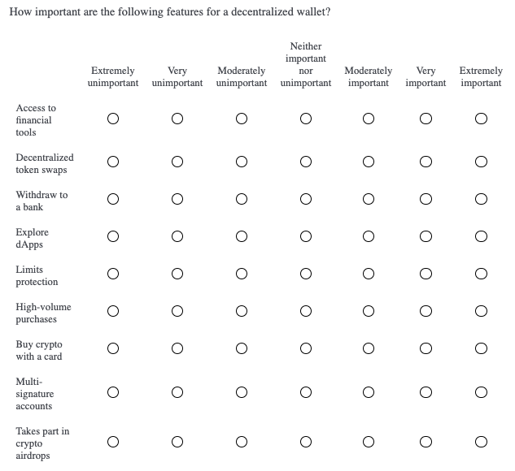
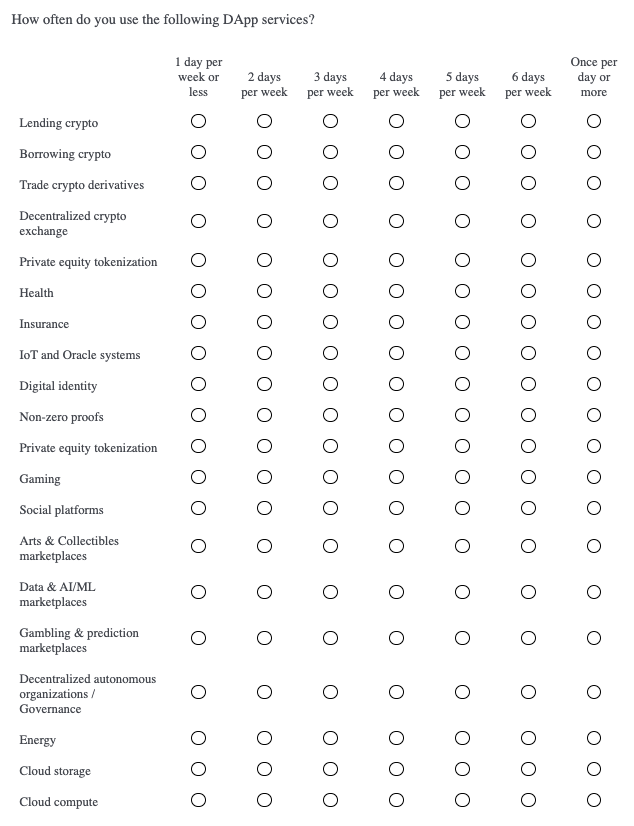
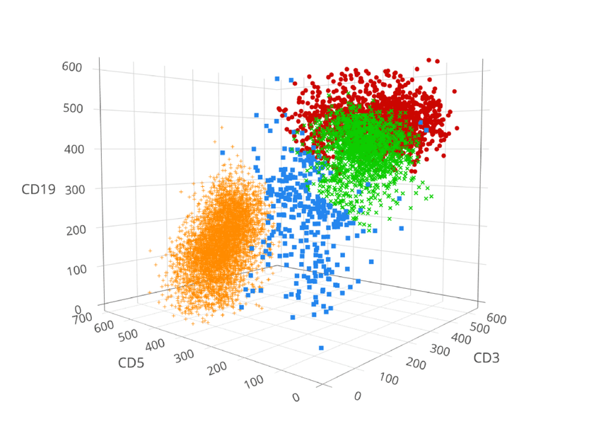
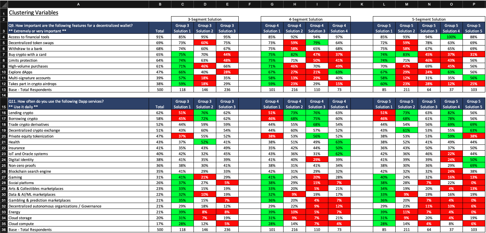
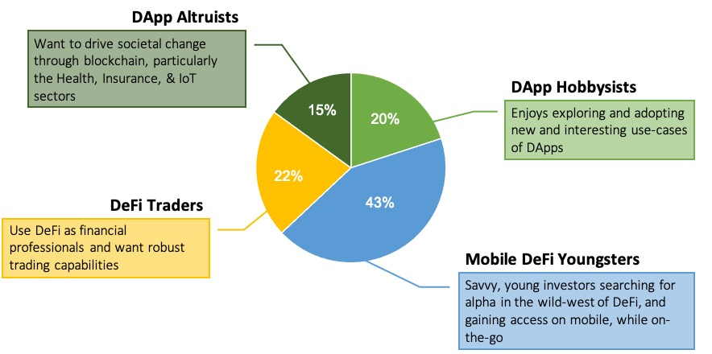
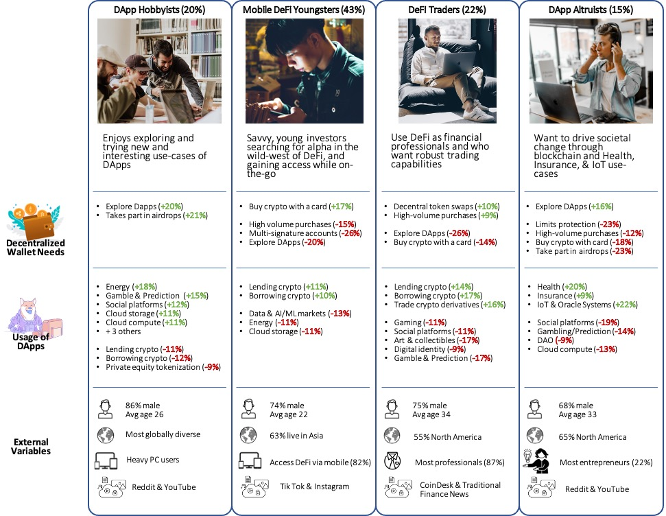

2 Identify target user segments with ML Clustering & Classification
===================================================================

Clustering is one of the three major classes of machine-learning (i.e. clustering, classification, and regression). Observations are clustered together based on similarity across a set of variables. In this way, we explore data sets, searching for hidden patterns, like groups of respondents who give similar survey answers to one another. The goal is to maximize the similarity of respondents in a group, while maximizing dissimilarity with respondents in other groups (Seif [2021](#ref-seif_5_2021)).

  

The field of Market Research has employed this technique for decades to divide markets into distinct customer segments, each with unique wants and needs (Qualtrics [2020](#ref-qualtrics_market_2020)[b](#ref-qualtrics_market_2020)). This helps devise more effective marketing and sales campaigns by targeting smaller, yet more precisely-defined customer segments, rather than the average customer of an entire market. There are many ways these segments can be defined, but it’s helpful to think of three major approaches to segmentation:

  

**\- Demographics** (e.g. age, gender, income, education)  
**\- Usage and Behaviors** (e.g. category usage, product usage)  
**\- Attitudes** (e.g. interests, values, personality)

  

Segmentation has major implications for product design as well - it identifies user segments with vastly different product needs and wants. Again, instead of developing a product for the average user, we can identify niche user groups with unique needs and target these users with products optimized for their specific use-case. Segmentation can also be thought of as a search for early-adopter groups.

  

In addition to the segmentation variables, we also capture other important information on the segments like media usage, demographics, psychographics, and technographics - really anything else that will help us craft an effective go-to market strategy and outreach campaign (e.g. better ad targeting on platforms like Google, LinkedIn and Facebook).

  

There is great similarity between segmentation and persona development, a technique found often in UX and design research. The former is quantitative with large sample sizes that allow us to make statistically-credible claims about the market and its segments. The ladder is more lightweight and qualitative.

  

Persona development details the specific UX pain points and user journey of each persona. Segmentation and persona development should be used as a complement to one another. For example, you could start with a market segmentation, develop a typing tool, use the typing tool to recruit participants from your target segments, and extend the targets’ profiles with in-depth UX research. We’ll discuss all of this more in detail later on.

  
  
  

2.1 Market Segmentation for Product Design
------------------------------------------

Our company wants to launch a new and improved decentralized wallet for current users of DApps and blockchain-related projects. This blockchain market is fast-moving and highly diverse, so we require a market segmentation to better understand its constituent users in terms of their current category usage and decentralized wallet needs. We do this to inform our product design, so that we provide an ideal solution for a subset of the market rather than an average solution for the entire market. We want to quickly attract a group of early-adopters to validate product market fit and start generating revenue to keep our startup afloat (Blank [2013](#ref-blank_four_2013)). Then we can transition to growth strategies, by this comes later.

  

We take a hybrid approach and use two of the three types of segmentation variables listed above: attitudes and behaviors. The market will be segmented based on “decentralized wallet needs” (product attitudes) and “usage of DApps” (category behavior). The former consists of 9 variables and the ladder, 20 variables. These 29 variables are referred to as “clustering”, or “internal”, variables because they are the variables we apply the clustering algorithm to. We will discuss “external variables” later on, but for now we show the clustering variables below.

  

    list("How important are the following features for a decentralized wallet?" = key[1:9],
         "How often do you use the following DApp services?" = key[10:29])

    ## $`How important are the following features for a decentralized wallet?`
    ## [1] "Buy crypto with a card"        "Explore dApps"                
    ## [3] "Access to financial tools"     "Withdraw to bank"             
    ## [5] "Limits protection"             "High-volume purchases"        
    ## [7] "Decentralized token swaps"     "Multi-signature accounts"     
    ## [9] "Takes part in crypto airdrops"
    ## 
    ## $`How often do you use the following DApp services?`
    ##  [1] "Lending crypto"                                     
    ##  [2] "Borrowing crypto"                                   
    ##  [3] "Trade crypto derivatives"                           
    ##  [4] "Decentralized crypto exchange"                      
    ##  [5] "Private equity tokenization"                        
    ##  [6] "Health"                                             
    ##  [7] "Insurance"                                          
    ##  [8] "IoT and Oracle systems"                             
    ##  [9] "Digital identity"                                   
    ## [10] "Non-zero proofs"                                    
    ## [11] "Blockchain search engine"                           
    ## [12] "Gaming"                                             
    ## [13] "Social platforms"                                   
    ## [14] "Arts & Collectibles marketplaces"                   
    ## [15] "Data & AI/ML marketplaces"                          
    ## [16] "Gambling & prediction marketplaces"                 
    ## [17] "Decentralized autonomous organizations / Governance"
    ## [18] "Energy"                                             
    ## [19] "Cloud storage"                                      
    ## [20] "Cloud compute"

  

Make sure your clustering variables are related to actionable aspects of your product. “Decentralized wallet needs” give us the most important wallet features for each segment. And “usage of DApps” indicate the most important app content and DApp functionalities for each segment. These are our product design pillars.

  

Also, when creating clustering variables, make sure to go for breadth and touch on all the different kinds of attitudes and behaviors present in your market. It’s okay if some variables are irrelevant to most respondents - we want good coverage so we can identify niche segments if they exist. We can always simplify a clustering solution by reducing it to the most important variables. This brings me to another point - segmentation is an iterative process. Rarely do we find a workable solution on the first run. It’s up to the analyst to generate different clustering solutions (i.e. different clustering variables and different numbers of clusters) and search out the solution that best meets product design objectives.

  
  
  

2.2 Data Collection
-------------------

The most common clustering techniques require numeric data as input. We capture our clustering variables with 7-point likert scales - one is an importance rating and the other is frequency of use. If you remember from previous chapters, other numeric data can be used for clustering respondents like factor scores , and utilities from Max Diff and Conjoint analysis (see Projects [1](Project1.html#Project1), [3](Project3.html#Project3), and [4](Project4.html#Project4)). Also, other clustering methods support a mix of numeric and categorical variables, like Latent Class Analysis (LCA). Just something to be aware of when designing segmentation studies. Our clustering variable survey questions are shown below.

  

  

  

  

Of course, we will include more questions in the survey to capture other important information like psychographics, demgographics, technographics, and media usage. These are known as “external variables” because the segments are not based on them, but we use this extra information to further profile the segments. No matter what, there will be differences between the segments on the clustering variables - this is the mandate of clustering algorithms; however, it’s a good sign when there are differences between the segments on the external variables as well. When external variables correlate with segments it lends “external validity” to our clustering solution (Middleton [2019](#ref-middleton_4_2019)).

  

Understand that your total sample size gets split between each of the segments. This is why it’s important to start with a relatively large sample. Each segment must have a large enough sample size so that you can detect statistically significant differences between them on the clustering and external variables. How much sample you need depends on some starting assumptions: how many segments do you expect to find in the data and how precise does your stat testing need to be? Let’s reason through this below.

  

Three to seven segments is a reasonable first-guess. Two segments is generally too few and eight or more starts to get overly complicated. Let’s say you start with a total sample of 1000n and you expect 5 segments. Then the average segment size is 200n, although, in actuality, the segment sizes will vary around this average. Roughly speaking, you will be able to detect 10% or more differences between two segments of 200n each. Consider increasing the total sample size if you need greater precision.

  

You can conduct a “power analysis” if you want to be more rigorous than this “back-of-the-napkin” reasoning. There are [online calculators](http://powerandsamplesize.com/) where you specify your desired precision and it outputs a recommended sample size. It’s not uncommon to see market segmentations with 3000n-5000n. Like in any other study, the more the better. In our study we capture 500n due to resource constraints.

  

Finally, a note on the sampling plan. According to inferential statistics, we can make inferences, and claims, about a population (i.e. global DApp users) from a “randomly representative” sample of this population. We randomly sample global DApp users and pay special attention to potential sampling biases. For example, users in Asian countries may be less likely to respond to our English survey than users in North American countries. We can account for this ahead of time by setting quotas for each major geographic region. We just need to make sure that we accurately represent the true proportion of users from each geographic region. Survey platforms and sample agencies can help you with your recruiting requirements.

  
  
  

2.3 Segmentation Analysis
-------------------------

The resulting data frame contains 29 numeric clustering variables, each of which range from 1 to 7. We also have a respondent identifier, “UUID”. The final output from a clustering analysis assigns a segment to each UUID. For simplicity, the external variables have been removed from this data frame.

  

    head(dat)

    ## # A tibble: 6 x 30
    ##   uuid  q9_1p1r1 q9_1p1r2 q9_1p1r3 q9_1p1r4 q9_1p1r5 q9_1p1r6 q9_1p1r7 q9_1p1r8
    ##   <chr>    <dbl>    <dbl>    <dbl>    <dbl>    <dbl>    <dbl>    <dbl>    <dbl>
    ## 1 13yy…        6        7        6        4        3        6        4        6
    ## 2 80vt…        5        5        5        6        6        5        3        5
    ## 3 0r7p…        6        6        6        5        6        5        7        6
    ## 4 za9f…        6        7        7        6        4        6        3        5
    ## 5 wk25…        6        7        6        4        5        6        5        2
    ## 6 m32t…        7        7        6        7        7        6        7        2
    ## # … with 21 more variables: q9_1p1r9 <dbl>, q11_1p3r1 <dbl>, q11_1p3r2 <dbl>,
    ## #   q11_1p3r3 <dbl>, q11_1p3r4 <dbl>, q11_1p3r5 <dbl>, q11_1p3r6 <dbl>,
    ## #   q11_1p3r7 <dbl>, q11_1p3r8 <dbl>, q11_1p3r9 <dbl>, q11_1p3r10 <dbl>,
    ## #   q11_1p3r11 <dbl>, q11_1p3r12 <dbl>, q11_1p3r13 <dbl>, q11_1p3r14 <dbl>,
    ## #   q11_1p3r15 <dbl>, q11_1p3r16 <dbl>, q11_1p3r17 <dbl>, q11_1p3r18 <dbl>,
    ## #   q11_1p3r19 <dbl>, q11_1p3r20 <dbl>

  

In previous chapters, we’ve discussed problems with likert ratings - they notoriously suffer from scale-use biases because they are subjective measurements. Respondents use the scale differently from each other. Some consistently give low ratings, others medium ratings, and still others high ratings. We want to remove the variation caused by scale-use bias to mitigate its effects. In previous chapters, we handled this by standardizing the data with the scale() function. For our clustering purposes, we instead subtract a respondent’s average rating (across the 29 variables) from each one of his or her ratings. This operation makes it so that respondents’ ratings are comparable to one another.

  

First, we create a data frame with just our clustering variables, leaving out “UUID” for now.

  

    #Set clustering variables
    seg.vars <- c("q9_1p1r1",
                  "q9_1p1r2",
                  "q9_1p1r3",
                  "q9_1p1r4",
                  "q9_1p1r5",
                  "q9_1p1r6",
                  "q9_1p1r7",
                  "q9_1p1r8",
                  "q9_1p1r9",
                  "q11_1p3r1",
                  "q11_1p3r2",
                  "q11_1p3r3",
                  "q11_1p3r4",
                  "q11_1p3r5",
                  "q11_1p3r6",
                  "q11_1p3r7",
                  "q11_1p3r8",
                  "q11_1p3r9",
                  "q11_1p3r10",
                  "q11_1p3r11",
                  "q11_1p3r12",
                  "q11_1p3r13",
                  "q11_1p3r14",
                  "q11_1p3r15",
                  "q11_1p3r16",
                  "q11_1p3r17",
                  "q11_1p3r18",
                  "q11_1p3r19",
                  "q11_1p3r20")
    
    seg <- dat[,seg.vars]

  

    #Subtract row means 
    rMean <- rowMeans(seg)
    for(i in 1:(count(seg)[[1]])){
            seg[i,1:(length(seg))] <- seg[i,1:(length(seg))] - rMean[i]
    }
    
    head(seg)

    ## # A tibble: 6 x 29
    ##   q9_1p1r1 q9_1p1r2 q9_1p1r3 q9_1p1r4 q9_1p1r5 q9_1p1r6 q9_1p1r7 q9_1p1r8
    ##      <dbl>    <dbl>    <dbl>    <dbl>    <dbl>    <dbl>    <dbl>    <dbl>
    ## 1   0.310    1.31     0.310    -1.69   -2.69      0.310   -1.69    0.310 
    ## 2   0.172    0.172    0.172     1.17    1.17      0.172   -1.83    0.172 
    ## 3  -0.0345  -0.0345  -0.0345   -1.03   -0.0345   -1.03     0.966  -0.0345
    ## 4   0.724    1.72     1.72      0.724  -1.28      0.724   -2.28   -0.276 
    ## 5   0.655    1.66     0.655    -1.34   -0.345     0.655   -0.345  -3.34  
    ## 6   0.414    0.414   -0.586     0.414   0.414    -0.586    0.414  -4.59  
    ## # … with 21 more variables: q9_1p1r9 <dbl>, q11_1p3r1 <dbl>, q11_1p3r2 <dbl>,
    ## #   q11_1p3r3 <dbl>, q11_1p3r4 <dbl>, q11_1p3r5 <dbl>, q11_1p3r6 <dbl>,
    ## #   q11_1p3r7 <dbl>, q11_1p3r8 <dbl>, q11_1p3r9 <dbl>, q11_1p3r10 <dbl>,
    ## #   q11_1p3r11 <dbl>, q11_1p3r12 <dbl>, q11_1p3r13 <dbl>, q11_1p3r14 <dbl>,
    ## #   q11_1p3r15 <dbl>, q11_1p3r16 <dbl>, q11_1p3r17 <dbl>, q11_1p3r18 <dbl>,
    ## #   q11_1p3r19 <dbl>, q11_1p3r20 <dbl>

  

### 2.3.1 Check Data Clumpiness

Once this is done, we move onto an initial diagnostic called the Hopkins Statistic. The Hopkins statistic measures the extent that the points are randomly spaced, or the degree that the points clump together (Singh et al. [2020](#ref-singh_assessing_2020)). A score of .50 or above indicates that the data is random, with no discernible clustering patterns. Anything above .45 usually fails to produce reliable clusters. Ideally the data yield a score of .35 or below.

  

    #Calculate the Hopkins Statistic
    hopkins(seg, n=nrow(seg)-1)

    ## $H
    ## [1] 0.3078375

  

### 2.3.2 Predict Number of Clusters

Several statistical methods are available to estimate the number of clusters in our data set (Chapman and Feit [2019](#ref-chapman_r_2019)). We utilize the elbow, silhouette, and gap statistic methods below. Understand that this is only a statistical estimate - it’s a useful check and gives us a starting point. No matter what, the analyst should run multiple clustering solutions and, ultimately, decide which solution is most useful to meet business goals and aide in product design. In an ideal world, the statistical recommendation and researcher’s intuition match each other.

  

    ##Elbow method
    suppressMessages(fviz_nbclust(seg[,seg.vars], kmeans, method = "wss"))

    ##Silhouette method
    suppressMessages(fviz_nbclust(seg[,seg.vars], kmeans, method = "silhouette"))

    ##Gap Statistic
    gap_stat <- suppressWarnings(clusGap(seg[,seg.vars], FUN = kmeans, nstart = 25, K.max = 10, B = 50))
    suppressMessages(fviz_gap_stat(gap_stat))

  

The elbow method suggests 2 or 3-segment solutions. The silhouette and gap statistic methods both suggest 2-segment solutions. Again, segmentation is an iterative process. At this point, it’s trivial to generate multiple clustering solutions - that’s why I recommend running 2- through 10-segment solutions for any segmentation project. Then it’s a matter of cross-tabbing all the solutions and manually comparing the segments in each to find the solution with the best story. More on this below.

  

### 2.3.3 K-Means Clustering

Finally, we come to the actual clustering step. Respondents are clustered with one another based on “distance” from each other (Chapman and Feit [2019](#ref-chapman_r_2019)). From the perspective of linear algebra, it’s the same as calculating the distance between points. We can think of calculating 1D distance between points on a straight line. We can also think of 2D distances between points on a map. And 3D distances we can imagine as well (see the visual below). In this example, our “points” (i.e. respondents) fall in 29D-space because they are defined on 29 clustering variables. We cannot imagine this, but we can still calculate the distance between respondents just as easily as lower-dimensional points.

  

  

In this example we use K-Means, one of the simplest and most popular clustering algorithms. Let’s walk through each of its steps to grasp how distance-based clustering works (Seif [2021](#ref-seif_5_2021)).

  

**1\. Determine number of clusters (K)**  
Let’s say we set K = 3.

  

**2\. Initialize cluster centers**  
The algorithm selects three points at random. These correspond to the three initial cluster centers and are represented by the three triangles in Figure A below.

  

**3\. Assign all points to a cluster based on distance**  
The distance of each point is calculated from each of the three cluster centers. Points are then assigned to the closest cluster, represented by Figure B below.

  

**4\. Recalculate cluster centers**  
Move the cluster center to the mean of the points in that cluster. Do this for each cluster. This is shown in Figure C below.

  

**5\. Reassign points**  
Now, recalculate the distance of all points from each of the new cluster centers. Assign the points to the closest cluster center, shown in Figure D below.

  

**6\. Repeat steps 4-5 for a set number of iterations**  
Or until the clusters stop changing much

  

  

Understand that K-Means is non-deterministic - it will give a slightly different result each time. This is because of its random starting points (step 2 above), which can result in material differences between runs. To cope with this deficiency, we use a modified algorithm called convergent k-means to assign segment membership. Instead of just one run, convergent k-means executes multiple runs (30 in our example below), each with randomly selected starting points, and the run most in common with all others (convergent validity) is chosen as the final solution. We start with 3-segment, 4-segment, and 5-segment solutions (Software [2008](#ref-sawtooth_software_software_2008)).

  

    #Set seed in order to reproduce results since k-means is non-deterministic
    set.seed(1221)
    
    # Run multiple convergent k-means solutions
    k3 <- kmeans(seg[,seg.vars], centers = 3, nstart = 30)
    k4 <- kmeans(seg[,seg.vars], centers = 4, nstart = 30)
    k5 <- kmeans(seg[,seg.vars], centers = 5, nstart = 30)

  

Each solution assigns a segment to each respondent. These segment assignments are matched to the corresponding respondents’ UUID and merged with the original data set.

  

    #Combine UUID and segment assignment
    k3_solution <- cbind(uuid = dat[,"uuid"], segment = k3$cluster)
    k4_solution <- cbind(uuid = dat[,"uuid"], segment = k4$cluster)
    k5_solution <- cbind(uuid = dat[,"uuid"], segment = k5$cluster)
    
    head(k4_solution)

    ##               uuid segment
    ## 1 13yysky1ret5h35t       3
    ## 2 80vtc8cxt39mz0r7       4
    ## 3 0r7pd41acn8r37nc       2
    ## 4 za9fzvq9jkfnwnzj       3
    ## 5 wk25yf88v4hb3ggn       1
    ## 6 m32t7hcpzgkh1e0f       1

  

Also, we can quickly check the segment sizes by looking at how many respondents were grouped into each segment. It appears we start running into small sample sizes (i.e. 37n) in the 5-segment solution. This will likely dissuade us from choosing 5 or more segments as the final solution.

  

    list("3-Segment Sizes" = summary(as.factor(k3_solution[,"segment"])),
         "4-Segment Sizes" = summary(as.factor(k4_solution[,"segment"])),
         "5-Segment Sizes" = summary(as.factor(k5_solution[,"segment"]))
         )

    ## $`3-Segment Sizes`
    ##   1   2   3 
    ## 118 146 236 
    ## 
    ## $`4-Segment Sizes`
    ##   1   2   3   4 
    ## 101 216 110  73 
    ## 
    ## $`5-Segment Sizes`
    ##   1   2   3   4   5 
    ##  85 211  64  37 103

  

Finally, we calculate the average of each clustering variable, grouped by segment (shown below). This gives us an overview of how the segments differ from one another in terms of “decentralized wallet needs” and “usage of DApps”; however, it is very difficult to conduct a meaningful analysis here.

  

It’s a good initial check for segment differences but we are now ready to generate crosstabs. Each solution should have its own banner with the corresponding segments in the columns. This allows the analyst to compare clustering and external variables between the segments. The analyst then studies over- and under-indexing variables in search of a preferable solution.

  

    k4$centers

    ##      q9_1p1r1  q9_1p1r2    q9_1p1r3    q9_1p1r4    q9_1p1r5    q9_1p1r6
    ## 1  0.28166610 1.2222602  0.22226016  0.28166610  0.32127006  0.03414135
    ## 2  0.03081098 0.3872925 -0.05715198 -0.02474457 -0.02474457 -0.07104087
    ## 3 -0.45172414 1.5300940  0.43918495  0.66645768 -0.01536050 -0.37899687
    ## 4  0.85498347 1.2933396  0.33443552 -0.10392064 -0.18611242  0.67690128
    ##     q9_1p1r7   q9_1p1r8   q9_1p1r9 q11_1p3r1   q11_1p3r2 q11_1p3r3   q11_1p3r4
    ## 1 -0.1539775 -1.7084329 -1.1737794 0.7173097 -1.62922499 1.1034483 0.350973028
    ## 2 -0.4090038 -0.2191890 -0.4691890 0.2622925 -0.04326309 0.2345147 0.003033206
    ## 3 -1.5062696  0.2028213 -0.2244514 1.1664577  0.16645768 1.2664577 0.611912226
    ## 4 -1.9258385 -0.4052905 -1.9943316 0.9097780 -0.92583845 1.1837506 0.183750590
    ##     q11_1p3r5 q11_1p3r6 q11_1p3r7  q11_1p3r8  q11_1p3r9 q11_1p3r10  q11_1p3r11
    ## 1 -0.67872994 0.9945374 0.1727552 -1.3222943 0.81631956 -0.9559577 -0.11437351
    ## 2 -0.14511494 0.3502554 0.1095147 -0.2284483 0.05858876 -0.1034483  0.04469987
    ## 3 -1.05172414 1.2755486 0.1846395 -1.1153605 0.81191223 -1.4153605 -0.49717868
    ## 4  0.01936703 1.3207369 0.4577232 -0.4463864 0.95087388 -0.3094001 -0.46008503
    ##   q11_1p3r12  q11_1p3r13 q11_1p3r14   q11_1p3r15 q11_1p3r16 q11_1p3r17
    ## 1  0.8955275  0.05394333  0.8856265  0.687606692 -0.8668488 -0.8767497
    ## 2  0.2576628 -0.09418902  0.1558110 -0.006226054 -0.1219668 -0.1034483
    ## 3  0.9755486 -1.40626959  0.9664577  0.230094044 -1.0335423 -1.9608150
    ## 4  0.9919698 -1.30940009  0.8001889 -1.268304204 -0.8984412 -1.8025508
    ##    q11_1p3r18 q11_1p3r19 q11_1p3r20
    ## 1 -0.78764083  0.6083988  0.6182998
    ## 2 -0.02474457  0.0956258  0.1558110
    ## 3 -0.58808777  0.7210031  0.4300940
    ## 4  0.53991497  0.7727917  0.7453944

  

### 2.3.4 Segment Comparisons with Crosstabs

The image below shows an example of crosstab output. It summarizes the clustering variables for all three of our clustering solutions. Cells are colored green and red to represent over- and under-indexing from Total (2nd column from left), respectively. We are only interested in comparing the segments within the same clustering solution. Ideally, each segment will over-index on some variables and under-index on others. You could imagine a solution with one segment over-indexing and all the others under-indexing. This doesn’t really give us much information - one segment “wants it all” and the other segments remain undifferentiated. If you run into this problem, check that you centered the likert responses, like we did at the beginning of this section. Also, please note that the crosstab data shown below has been altered from the original data used in this project - if you calculate crosstabs, your output will be slightly different.

  

  

Remember that our original variables are likert scale ratings. We show top box and top 2 box percentages rather than mean ratings in the crosstabs above. This allows us to discuss the clustering variables in terms of percentages (e.g. “32% of Segment 1 said…”), which improves interpretability in my opinion. Of course, you can stat test proportions with chi-square and means with ANOVA, and should follow-up with t-tests between segments and Total, to determine over/under-indexing (Sauro and Lewis [2016](#ref-sauro_quantifying_2016)).

  

Now is also the time to compare external variables between segments within the same solution. We left the external variables off of the image above but, again, it creates a better story when there exist meaningful differences on the external variables, like demographics. Looking between clustering and external variables, try to build segment stories in your mind. Do decentralized wallet needs correspond to DApp usage in ways that we would expect (e.g. DeFi wallet needs correspond to heavier DeFi usage)? Are demographics like age, occupation, and geography correlated with segments?

  

### 2.3.5 Cluster Reproducibility

Cluster reproducibility is a diagnostic for assessing cluster quality. It’s rarely reported to stakeholders but worthwhile to check that reproducibility meets minimum standards. Reproducibility is thought of in terms of the overlap in segments between two clustering solutions. If the segments perfectly overlap (e.g. all of the respondents that are grouped together in solution A are also grouped together in solution B), then the clusters are said to be 100% “reproducible”. We expect our cluster solutions to be more reproducible than random chance assignment (e.g. 33% overlap for a 3-segment solution).

  

For this, we use a metric called Adjusted Rand Index (ARI). It calculates the overlap between a pair of clustering solutions. We calculate an ARI for 250 cluster solution pairs and average these for a final reproducibility score. Sawtooth suggests a similar process using a confusion matrix, where the percent accuracy represents the reproducibility score (Software [2008](#ref-sawtooth_software_software_2008)).

  

    rand <- vector()
    for(i in 1:250) {
    set.seed(i)
    k_x <- kmeans(seg[,seg.vars], centers = 3, nstart = 30)
    
    fit1 <- as.numeric(k_x$cluster) #cluster solution 1
    
    set.seed(1000 + i)
    k_x <- kmeans(seg[,seg.vars], centers = 3, nstart = 30)
    
    fit2 <- as.numeric(k_x$cluster) #cluster solution 2
    
    
    clust_stats <- cluster.stats(d = dist(seg[,1:length(seg.vars)]), 
                                 fit1, fit2) 
    
    rand[i] <- clust_stats$corrected.rand 
    }
    k3_ARI <- mean(rand)
    
    
    rand <- vector()
    for(i in 1:250) {
    set.seed(i)
    k_x <- kmeans(seg[,seg.vars], centers = 4, nstart = 30)
    
    fit1 <- as.numeric(k_x$cluster)
    
    set.seed(1000 + i)
    k_x <- kmeans(seg[,seg.vars], centers = 4, nstart = 30)
    
    fit2 <- as.numeric(k_x$cluster)
    
    
    clust_stats <- cluster.stats(d = dist(seg[,length(seg.vars)]), 
                                 fit1, fit2)
    
    rand[i] <- clust_stats$corrected.rand
    }
    k4_ARI <- mean(rand)
    
    
    rand <- vector()
    for(i in 1:250) {
    set.seed(i)
    k_x <- kmeans(seg[,seg.vars], centers = 5, nstart = 30)
    
    fit1 <- as.numeric(k_x$cluster)
    
    set.seed(1000 + i)
    k_x <- kmeans(seg[,seg.vars], centers = 5, nstart = 30)
    
    fit2 <- as.numeric(k_x$cluster)
    
    
    clust_stats <- cluster.stats(d = dist(seg[,length(seg.vars)]), 
                                 fit1, fit2)
    
    rand[i] <- clust_stats$corrected.rand
    }
    k5_ARI <- mean(rand)
    
    list("3-Segment Solution Reproducibility" = k3_ARI,
         "4-Segment Solution Reproducibility" = k4_ARI,
         "5-Segment Solution Reproducibility" = k5_ARI)

    ## $`3-Segment Solution Reproducibility`
    ## [1] 0.9997879
    ## 
    ## $`4-Segment Solution Reproducibility`
    ## [1] 0.9497817
    ## 
    ## $`5-Segment Solution Reproducibility`
    ## [1] 0.7939965

  

We see each of the above reproducibility scores beat random chance assignment (i.e. 33%, 25%, and 20%). This validates our segmentation overall - that we have discovered real and reproducible segments within the data.

  
  
  

### 2.3.6 Final Segment Solution

Based on crosstab analysis, our pre-existing knowledge of the blockchain market, and the product vision, we proceed with the 4-segment solution. It splits the market into the most actionable segments, with the best story. Now we “tell” this story with two major deliverables: segment sizing and segment profiles. The segment sizes shown below are calculated by dividing each segment size by total number of respondents (i.e. 500n).

  

  

  

  

The market splits into four segments: DApp Hobbyists, Mobile DeFi Youngsters, DeFi Traders, and DApp Altruists. As one can see, each profile is defined by the clustering and external variables that they over- and under-index on. This is how the segments are differentiated from one another. For example, the DApp Hobbyists find it most important out of all the segments to be able to explore DApps within their decentralized wallets. And this is backed up by their DApp usage - they are the heaviest DApp users in terms of variety and frequency (e.g. they over-index on 8 DApp services). Interestingly, they under-index on DeFi usage, perhaps the most common DApp category at the time of writing. So they explore many different DApp categories like art, gaming, social platforms (and more), but access DeFi the least out of all other segments.

  

Compare this to the next two segments: Mobile DeFi Youngsters and DeFi Traders. Both of these segments over-index on DeFi usage, but there are still major differences between the two of them. The former is the youngest of all segments, they access DeFi the majority of the time on mobile devices (82%) and least want high-volume purchasing capabilities out of all segments, perhaps because they have smaller amounts of capital to invest (via their debit cards). The DeFi Traders, on the other hand, trade crypto derivatives and want high-volume purchasing capabilities more than anyone. They are also the oldest segment, with the most professionals, and disproportionately consume trading news like CoinDesk and traditional financial sources. Finally, DeFi Traders under-index on more recreational forms of DApps like social platforms, arts/collectibles, and gaming.

  

Lastly, DApp Altruists, like the DApp Hobbyists, are interested in exploring DApps, particularly the health, insurance, and IoT sectors. Over one-fifth consider themselves entrepreneurs, which is an enormous over-index compared to Total. Thus, at this time, we believe they are interested in building products in the aforementioned DApp sectors.

  

DApp Hobbyists make the most sense for our target user group. They are a significant size of the overall market (20%) but current wallets are underdeveloped in terms of their main need, DApp exploration. There are many current solutions for DeFi integration in decentralized wallets, but less integration for more niche DApp categories like art, gambling, gaming, and social platforms. This is where we will focus our product design.

  

The reasoning is an example of how to interpret a segmentation. In order to tell the story sometimes we have to stretch the data a bit and fill in gaps with some of our assumptions; however, we can continue studying these segments in subsequent qual and quant studies. In order to do so we first must develop a typing tool.

  
  
  

2.4 Typing Tool
---------------

Once a clustering solution has been selected, we can create a typing tool, or segment classifier, which assigns respondents a segment based on their answers to the clustering variables. A classification algorithm is trained on our segmentation data, with “segment” as the outcome variable and the clustering variables as predictors. First, we determine the importance of each clustering variable in predicting segment membership (using a classification tree). Then we train a classification algorithm (LDA) on the most important clustering variables in order to meet a minimum classification accuracy, like 80%.

  

This subset of clustering variables used to train the classification model is called a “reduced segmentation battery”. These variables will be included in subsequent surveys, which allows us to extend the segmentation and continue learning about the segments in future studies.

  

### 2.4.1 Variable Importance

First, the segment assignments are merged back into the full data frame (containing the original clustering variables) using respondent UUID.

  

    #merge segment solution (4-group) with df containing clustering variables
    
    dat <- merge(dat, k4_solution, by = "uuid" )
    
    dat[,"segment"] <- as.factor(dat[,"segment"])

  

Next, we fit a classification tree to our data with segment as the outcome and clustering variables as the predictors. Classification trees are able to tell us the importance of predictor variables in determining segment membership. We then rank the variables from greatest to least in terms of importance.

  

    #Classification tree for variable importance
    
    tree <- rpart(dat$segment ~ ., data = dat[,seg.vars])
    imp <- varImp(tree)
    imp <- as.data.frame(cbind(rownames(imp),imp[1]))
    imp[,1] <- as.character(imp[,1])
    imp <- arrange(imp,desc(imp[,2]))
    
    print(imp)

    ##            rownames(imp)   Overall
    ## q9_1p1r8        q9_1p1r8 94.606074
    ## q11_1p3r13    q11_1p3r13 90.100260
    ## q9_1p1r7        q9_1p1r7 73.300234
    ## q11_1p3r2      q11_1p3r2 70.613372
    ## q11_1p3r10    q11_1p3r10 67.847299
    ## q11_1p3r17    q11_1p3r17 53.704667
    ## q9_1p1r9        q9_1p1r9 38.037058
    ## q11_1p3r16    q11_1p3r16 28.122422
    ## q11_1p3r5      q11_1p3r5 27.101159
    ## q9_1p1r1        q9_1p1r1 23.054217
    ## q11_1p3r15    q11_1p3r15 15.193080
    ## q11_1p3r18    q11_1p3r18  8.677428
    ## q9_1p1r2        q9_1p1r2  8.314011
    ## q11_1p3r4      q11_1p3r4  6.986827
    ## q11_1p3r8      q11_1p3r8  6.951681
    ## q11_1p3r3      q11_1p3r3  5.326242
    ## q11_1p3r9      q11_1p3r9  5.043375
    ## q9_1p1r6        q9_1p1r6  4.229282
    ## q11_1p3r1      q11_1p3r1  3.780633
    ## q11_1p3r7      q11_1p3r7  3.166163
    ## q11_1p3r6      q11_1p3r6  2.904560
    ## q9_1p1r3        q9_1p1r3  2.831274
    ## q11_1p3r14    q11_1p3r14  1.964803
    ## q11_1p3r20    q11_1p3r20  1.964803
    ## q9_1p1r4        q9_1p1r4  0.000000
    ## q9_1p1r5        q9_1p1r5  0.000000
    ## q11_1p3r11    q11_1p3r11  0.000000
    ## q11_1p3r12    q11_1p3r12  0.000000
    ## q11_1p3r19    q11_1p3r19  0.000000

  

### 2.4.2 Fitting Classification Models with LDA

We use Linear Discriminant Analysis (LDA) as our classification algorithm. Classification models are assessed based on “accuracy”, which is calculated via a confusion matrix. Accuracy measures the overlap between the actual segment (from the clustering solution) and the segment assignment by the classification algorithm. In order to test this accuracy we first must partition the data into train/test sets (80%/20%). We train the algorithm on the the training data set, and test its accuracy on the test data set. This is called out-of-sample validation, because we test model performance on an independent data set. Testing the classification accuracy with the training data set would inflate the accuracy of the model.

  

We want to compute accuracy for multiple classification models, which is handled with the for-loop below. We start by fitting a classification model using the top 2 most important predictors and calculate the model’s accuracy. In the next iteration, we fit a model using the top 3 predictors and calculate its accuracy. This continues until we fit a model with all 29 possible predictors (i.e. the clustering variables). We end with a data frame that shows us accuracy for each of these models.

  

    # partition training and test
    index <- createDataPartition(dat$segment, p = .8, list = FALSE)
    
    #determine accuracies for different variable subsets 
    acc <- data.frame()
    for(i in 2:(length(seg.vars))){
            seg.reduced <- imp[1:i,1]
            
            linda <- linDA(group = dat$segment, 
                             variables = as.data.frame(dat[,seg.reduced]),
                             learn = as.vector(index),
                             test = as.vector(which("FALSE" == as.vector(1:500) %in% index)), 
                             validation = "learntest")
            
            accuracy = 1 - linda$error_rate
            
            acc[i,1] <- paste(i, "variable model")
            acc[i,2] <- accuracy
    }
    
    print(acc[-1,])

    ##                   V1        V2
    ## 2   2 variable model 0.6161616
    ## 3   3 variable model 0.6262626
    ## 4   4 variable model 0.5959596
    ## 5   5 variable model 0.6060606
    ## 6   6 variable model 0.6767677
    ## 7   7 variable model 0.7474747
    ## 8   8 variable model 0.7373737
    ## 9   9 variable model 0.7575758
    ## 10 10 variable model 0.7979798
    ## 11 11 variable model 0.8080808
    ## 12 12 variable model 0.8181818
    ## 13 13 variable model 0.8686869
    ## 14 14 variable model 0.8888889
    ## 15 15 variable model 0.8686869
    ## 16 16 variable model 0.8888889
    ## 17 17 variable model 0.9191919
    ## 18 18 variable model 0.9292929
    ## 19 19 variable model 0.9292929
    ## 20 20 variable model 0.9393939
    ## 21 21 variable model 0.9393939
    ## 22 22 variable model 0.9292929
    ## 23 23 variable model 0.9191919
    ## 24 24 variable model 0.9090909
    ## 25 25 variable model 0.9191919
    ## 26 26 variable model 0.9191919
    ## 27 27 variable model 0.9090909
    ## 28 28 variable model 0.9090909
    ## 29 29 variable model 0.8989899

  

80% accuracy is the industry-standard for typing tool accuracy. We see that our classification model meets the threshold of 80% accuracy using the top 12 most important predictors. Thus we fit one last LDA using these 12 variables. LDA outputs linear equations for each segment (Ali [2019](#ref-ali_how_2019)). Each linear discriminant equation calculates the probability that a respondent is classified to that particular segment, given their responses on the 12 variables. The respondent is then assigned to the segment with the highest probability - this is how the typing tool works.

  

    #Final model using top 12 variables for 80%+ accuracy
    
    final.var <- imp[1:12,1]
    
    linda.final <- linDA(group = dat$segment, 
                             variables = as.data.frame(dat[,final.var]),
                             learn = as.vector(index),
                             test = as.vector(which("FALSE" == as.vector(1:500) %in% index)), 
                             validation = "learntest")
    
    linda.final$functions

    ##                      1           2           3           4
    ## constant   -30.5964554 -39.8181345 -28.9272902 -32.0326299
    ## q9_1p1r8     0.2664052   1.0345768   1.6184779   1.3095049
    ## q11_1p3r13   0.7341769   0.3032894  -0.4282449  -0.2923243
    ## q9_1p1r7     1.5013255   1.1240255   0.6339758   0.1414363
    ## q11_1p3r2    0.2117314   1.3763929   1.7857860   0.8162781
    ## q11_1p3r10   0.7345857   1.1780394   0.2738969   1.2191303
    ## q11_1p3r17   0.4229126   0.5928177  -0.5694264  -0.3166971
    ## q9_1p1r9     1.0747830   1.3624900   1.6217983   0.5326930
    ## q11_1p3r16   0.3066399   0.5383040   0.2225767   0.4561143
    ## q11_1p3r5    0.6756569   0.9393734   0.7064212   1.3861255
    ## q9_1p1r1     2.5615519   2.1283016   1.9160329   3.2155928
    ## q11_1p3r15   1.7772297   1.2880365   1.7326722   0.6212085
    ## q11_1p3r18   0.8333781   1.4872760   1.1766234   1.9022612

  

The columns represent coefficients in the linear equations. The equation for Segment 1 reads as:

  
  

**Segment 1 Likelihood** = -30.6 + 0.27**(q9\_1p1r8)** + 0.73**(q11\_1p3r13)** + 1.5**(q9\_1p1r7)** + 0.21**(q11\_1p3r2)** + 0.73**(q11\_1p3r10)** + 0.42**(q11\_1p3r17)** + 1.07**(q9\_1p1r9)** + 0.31**(q11\_1p3r16)** + 0.68**(q11\_1p3r5)** + 2.56**(q9\_1p1r1)** + 1.78**(q11\_1p3r15)**

  
  

Generally typing tools are built in excel. Typing tools take responses to clustering variables as input and multiply each column by the corresponding coefficient from the linear equation, like the one shown above. This is done with the linear equations for each of the segments and the respondent is then assigned to the segment that has the highest likelihood of all.

  
  
  

2.5 Conclusion
--------------

Segmentation studies are involved, yet powerful and highly strategic. We show how a segmentation can be used to inform the product design of a decentralized crypto wallet. First, we decided on the overall target market - current users of blockchain-related services. Then, we devised a set of variables on which to segment this market, “decentralized wallet needs” and “usage of DApps”. This makes for a set of 29 clustering variables, and other external variables, like demographics, were also captured during data collection.

  

Then we generated several solutions using convergent K-Means as the clustering algorithm. Each solution was exported to crosstabs with over and under-indexing marked by green and red cells, respectively. This stat testing revealed how the segments differentiated from one another, allowing us to find the solution with the best story. We chose the 4-segment solution and told its story with a market sizing diagram and profiles for each of the segments: DApp Hobbyists, Mobile DeFi Youngsters, DApp Altruists, and DeFi Traders. Finally, we chose DApp Hobbyists as a target, early-adopter segment, because their needs are not being met by current decentralized wallets. The current offerings support DeFi, but lack seamless integration with the wider DApp ecosystem.

  

After deciding on the 4-segment solution, we built a typing tool using a classification algorithm called Linear Discriminant Analysis. This typing tool allows us to assign segment membership to respondents who take our surveys in the future. We just need to be sure to capture responses on the reduced segmentation battery of 12 questions. In this way we can extend the segmentation study and continue learning about segments with subsequent quant and qual studies.

### Bibliography

Ali, T. 2019. “How to Apply an Lda Typing Tool in Q.” _Q Research Software_. [https://www.qresearchsoftware.com/how-to-apply-an-lda-typing-tool-in-q](https://www.qresearchsoftware.com/how-to-apply-an-lda-typing-tool-in-q).

Blank, Steven G. 2013. _The Four Steps to the Epiphany: Successful Strategies for Products That Win_. Fifth edition. California.

Chapman, C, and E Feit. 2019. _R for Marketing Research and Analytics_. New York, NY: Springer Berlin Heidelberg.

Middleton, F. 2019. “The 4 Types of Validity Explained with Easy Examples.” _Scribbr_. [https://www.scribbr.com/methodology/types-of-validity/](https://www.scribbr.com/methodology/types-of-validity/).

Qualtrics. 2020b. “Market Segmentation: Everything to Know in 2020 // Qualtrics.” _Qualtrics_. [https://www.qualtrics.com/experience-management/brand/what-is-market-segmentation/](https://www.qualtrics.com/experience-management/brand/what-is-market-segmentation/).

Sauro, Jeff, and James R. Lewis. 2016. _Quantifying the User Experience: Practical Statistics for User Research_. 2nd edition. Cambridge: Morgan Kaufmann.

Seif, George. 2021. “The 5 Clustering Algorithms Data Scientists Need to Know.” _Medium_. [https://towardsdatascience.com/the-5-clustering-algorithms-data-scientists-need-to-know-a36d136ef68](https://towardsdatascience.com/the-5-clustering-algorithms-data-scientists-need-to-know-a36d136ef68).

Singh, R, M Bergenholtz, S Korkmaz, and H Yan. 2020. “Assessing Clustering Tendency.” _Datanovia_. [https://www.datanovia.com/en/lessons/assessing-clustering-tendency/](https://www.datanovia.com/en/lessons/assessing-clustering-tendency/).

Software, Sawtooth. 2008. “Software for Convergent Cluster & Ensemble Analysis.” [https://sawtoothsoftware.com/uploads/sawtoothsoftware/originals/ccea\_manual.pdf](https://sawtoothsoftware.com/uploads/sawtoothsoftware/originals/ccea_manual.pdf).

