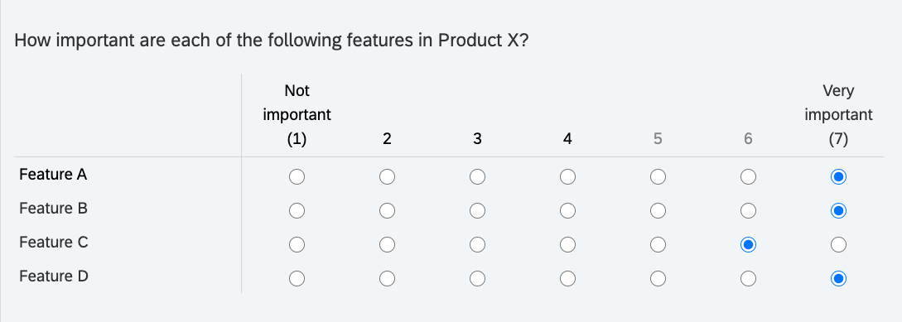
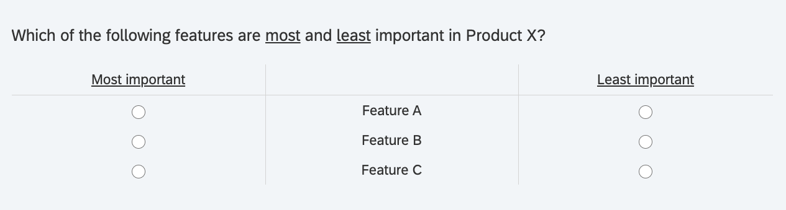
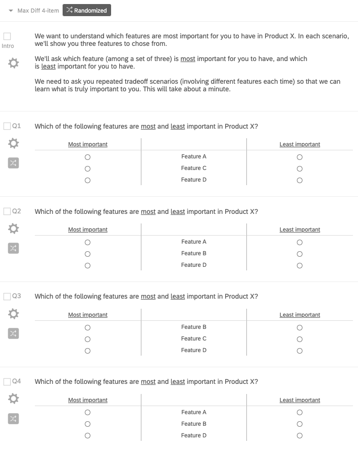
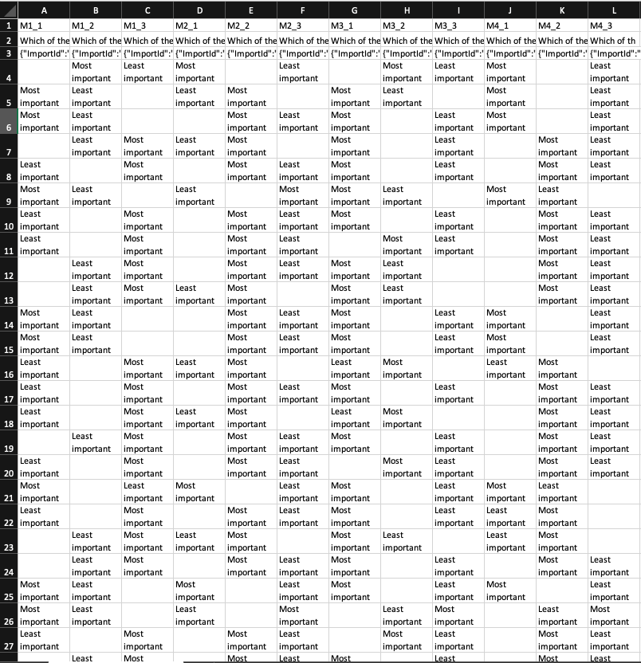

3 Prioritize product features and benefits with Max Diff
========================================================

Attribute importance seems to make its way into every quant study. Indeed, researchers love breaking down high-level concepts into their constituent attributes, or dimensions. Products can be reduced to top feature sets, companies to CX touchpoints (e.g. pre-purchase, purchase, post-purchase), and category usage to individual user behavior (e.g. video-streaming, music-streaming, document sharing/editing, etc.). Often, the goal is to rank-order the list of attributes from most important to least. This helps with prioritization - “what are the most critical points along the customer journey” or “which features should be included in the MVP?”

  

This is usually handled with individual importance ratings. For example, you break a product down into its individual features and use a likert scale to capture importance ratings for each. However, people want it all and will often give high ratings for most attributes. Also, likert scales are notorious for introducing response biases that undermine validity (Furnham [1986](#ref-furnham_response_1986)). Extreme responding and social desirability bias may apply in this case (Krumpal [2013](#ref-krumpal_determinants_2013)). Whatever the cause, it’s not possible to make trade-off decisions if features are undifferentiated during analysis (e.g. similar top box and top 2 box ratings).

  

  

Max Diff handles this problem by forcing respondents to make trade-off decisions between attributes. Its simplified scale works better across respondents from different cultures and differing cognitive abilities. Also, Max Diff gives the importance of attributes relative to one another; whereas, likert scales measure absolute importance. This makes Max Diff superior for directly comparing attributes with one another.

  

The image below shows an example of a single Max Diff question. Each Max Diff question takes a subset of the total attributes that we want to test, in this case product features. A full Max Diff experiment requires sets of these questions to test the different permutations of the total attribute list.

  

  
  
  

3.1 Max Diff for Product Design
-------------------------------

Let’s work through an example of testing the importance of four features for potential inclusion in the MVP of a SaaS product. This Max Diff experiment will allow us to rank order the features in terms of user importance. After all, the idea behind an MVP is determining the smallest possible feature set for which customers will pay. Thus, feature prioritization is essential for narrowing down a product team’s large list of potential features.

  

Note that a greater number of total attributes can be tested. I’ve heard of Max Diff experiments testing up to 40 different attributes. Qualtrics suggests Max Diff experiments with 8-25 attributes (Qualtrics [2020](#ref-qualtrics_maxdiff_2020)[c](#ref-qualtrics_maxdiff_2020)). The example here contains only four attributes for the sake of simplicity.

  
  
  

3.2 Experimental Design
-----------------------

Once the attribute list has been finalized, it’s time to design the Max Diff experiment, or the series of Max Diff questions shown to respondents. Certain conditions must be met to ensure experimental validity (e.g. equal weighting between all attributes). As stated before, each question uses a subset of total attributes. Therefore, the Max Diff experiment must follow a balanced-incomplete-block-design, or BIBD (jmp [2020](#ref-jmp_balanced_2020)).

  

It stipulates that:

*   **Attribute Balance:** All attributes need to be shown to the respondent the same number of times (e.g. each attribute is present in three Max Diff questions)
    
*   **Paired Balance:** Attributes need to be shown the same number of times with other attributes (e.g. feature A shown three times with feature B, C, and D)
    
*   **Randomization:** This is not part of BIBD, but essential for a valid experimental design. Max Diff questions and the position of attributes within the questions must be randomized to avoid ordering-biases.
    

  

Obtaining BIBD, especially for large attribute lists, gets complicated. Unless you work with a Combinatorial Mathematician ;) then you’ll use software to obtain the correct experimental design. This is the great value proposition of specialty software like [Sawtooth Software](https://sawtoothsoftware.com/) or even the choice-based add-on in Qualtrics. You simply enter your total attribute list and the software automatically generates a correct design, in survey format. Here, I’ll use R to search for the correct design.

  

    v <- 4 #Number of total attributes
    b <- 4 #Number of questions, or experimental "blocks"
    k <- 3 #Number of attributes per question (suggest 3 - 5)
    
    ibd <- ibd(v = v, b = b, k = k) #Create design
    
    isGYD(ibd$design) #Test if design is BIBD

    ## 
    ## [1] The design is a balanced incomplete block design w.r.t. rows.

    ibd$design

    ##         [,1] [,2] [,3]
    ## Block-1    1    3    4
    ## Block-2    1    2    4
    ## Block-3    2    3    4
    ## Block-4    1    2    3

  

In the design above, each row corresponds to one of the Max Diff questions in a 4-question series. Now, programming this design into a survey platform looks like the image below. We introduce the Max Diff experiment to respondents and randomize the order of the the four Max Diff questions, as well as the position of the features within each question.

  

  
  
  

3.3 Data Collection
-------------------

A Qualtrics Max Diff whitepaper recommends at least “300 completes as a general rule of thumb” (Qualtrics [2020](#ref-qualtrics_maxdiff_2020)[c](#ref-qualtrics_maxdiff_2020)). Max Diff can also be used for segmentation. In this case, individual segments should not go below 150n. This needs to be factored in at the beginning when developing a sampling plan. In this project, we capture 121 survey completes with potential early-adopters. Again, we are trying to understand the most important features to include in the MVP for so that target users adopt the product.

  

The image below shows the raw Max Diff data. Looking at the variables in the top row, “M1\_1” stands for Question 1 and the first attribute. So the respondent in row 5 selected Feature A as “Most important” from the three features shown in Question 1.

  

  
  
  

3.4 Analysis
------------

There are many methods for analyzing Max Diff data - we will look at two. The first method is a count-based approach. It is simple but somewhat flawed (Bock [2017](#ref-bock_how_2017)). In any case, it provides a reasonable approximation of relative feature importance. The second method uses statistical modeling for “utility estimation”. In this case, we will use an “aggregate multinomial logit” model that calculates average utilities across all respondents. Before we proceed, let’s convert the factor variables into numeric variables for count-based calculations.

  

    #Convert character string into numeric values (-1, 0, 1) for count analysis
    for(x in 2:length(dat)){
            for(i in 1:nrow(dat)){
                    if(dat[i,x] == "Least important"){
                           dat[i,x] <- -1
                    }
                    if(dat[i,x] == "Most important"){
                            dat[i,x] <- 1
                     } 
                    if(dat[i,x] == ""){
                             dat[i,x] <- 0
                     }
            }
            dat[,x] <- as.numeric(dat[,x])
    }
    head(dat)

    ##                  ID B1.featureA B1.featureC B1.featureD B2.featureA B2.featureB
    ## 1 R_3Hw3zJcXDckKKiY           0          -1           1          -1           1
    ## 2 R_3pfONRy8QkRqJ0k           0           1          -1           1           0
    ## 3 R_rjXJ7GxidKMX5E5           1          -1           0          -1           1
    ## 4 R_0CA8H1UBKY1Vj9L           1          -1           0           0           1
    ## 5 R_1lxTuuq3Ht3KMMV           0          -1           1          -1           1
    ## 6 R_2Y96IoXMaPdTugL          -1           0           1           0           1
    ##   B2.featureD B3.featureB B3.featureC B3.featureD B4.featureA B4.featureB
    ## 1           0           1          -1           0           0           1
    ## 2          -1           0           1          -1           1           0
    ## 3           0           1          -1           0           1           0
    ## 4          -1           1           0          -1           1           0
    ## 5           0           1           0          -1           0           1
    ## 6          -1           1           0          -1           0           1
    ##   B4.featureC
    ## 1          -1
    ## 2          -1
    ## 3          -1
    ## 4          -1
    ## 5          -1
    ## 6          -1

  

### 3.4.1 Count-Based

The count-based approach comes down to addition and subtraction. First, we want to know the total number of times, across all Max Diff questions, that a feature was chosen as both “Best” and “Worst”. The “Count” variable is calculated as “Best” - “Worst”, which gives a decent first guess for relative feature importance. We expect, or hope, that the subsequent analysis, using multinomial regression, corroborates the count-based results.

  

    #Count number of times feature A selected as "Most important" and "Least important"
    A.Best <- sum(dat[,"B1.featureA"] == 1) + sum(dat[,"B2.featureA"] == 1) + sum(dat[,"B4.featureA"] == 1)
    A.Worst <- sum(dat[,"B1.featureA"] == -1) + sum(dat[,"B2.featureA"] == -1) + sum(dat[,"B4.featureA"] == -1)
    
    #Count number of times feature B selected as "Most important" and "Least important"
    B.Best <- sum(dat[,"B2.featureB"] == 1) + sum(dat[,"B3.featureB"] == 1) + sum(dat[,"B4.featureB"] == 1)
    B.Worst <- sum(dat[,"B2.featureB"] == -1) + sum(dat[,"B3.featureB"] == -1) + sum(dat[,"B4.featureB"] == -1)
    
    #Count number of times feature C selected as "Most important" and "Least important"
    C.Best <- sum(dat[,"B1.featureC"] == 1) + sum(dat[,"B3.featureC"] == 1) + sum(dat[,"B4.featureC"] == 1)
    C.Worst <- sum(dat[,"B1.featureC"] == -1) + sum(dat[,"B3.featureC"] == -1) + sum(dat[,"B4.featureC"] == -1)
    
    #Count number of times feature D selected as "Most important" and "Least important"
    D.Best <- sum(dat[,"B1.featureD"] == 1) + sum(dat[,"B2.featureD"] == 1) + sum(dat[,"B3.featureD"] == 1)
    D.Worst <- sum(dat[,"B1.featureD"] == -1) + sum(dat[,"B2.featureD"] == -1) + sum(dat[,"B3.featureD"] == -1)
    
    count_dat <- tibble(
            "Best" = c(A.Best,
                       B.Best,
                       C.Best,
                       D.Best),
           "Worst" = c(A.Worst,
                       B.Worst,
                       C.Worst,
                       D.Worst)
           )
    
    count_dat <- mutate(count_dat, Count = Best - Worst)
    
    count_dat <- as.data.frame(count_dat)
    
    rownames(count_dat) <- c("Feature A",
                             "Feature B",
                             "Feature C",
                             "Feature D")
    
    print(count_dat)

    ##           Best Worst Count
    ## Feature A   57   111   -54
    ## Feature B  250    36   214
    ## Feature C   55   192  -137
    ## Feature D  118   136   -18

  

Here, feature B wins with the highest count. It was selected as “Most important” 250 times across all respondents and all Max Diff questions, and only 36 times as “Least important”. We can also calculate the top feature choice for each respondent then, for each feature, calculate the percentage of respondents with that feature as their top choice.

  

    dat2 <- dat
    dat2 <- mutate(rowwise(dat2), featureA = mean(c(B1.featureA, B2.featureA, B4.featureA)))
    dat2 <- mutate(rowwise(dat2), featureB = mean(c(B2.featureB, B3.featureB, B4.featureB)))
    dat2 <- mutate(rowwise(dat2), featureC = mean(c(B1.featureC, B3.featureC, B4.featureC)))
    dat2 <- mutate(rowwise(dat2), featureD = mean(c(B1.featureD, B2.featureD, B3.featureD)))
    
    
    A <- 0
    B <- 0
    C <- 0
    D <- 0
    for(i in 1:nrow(dat2)){
            if(names(which.max(dat2[i,14:17])) == "featureA"){
                    A <- A + 1
            }
            
            if(names(which.max(dat2[i,14:17])) == "featureB"){
                    B <- B + 1
            }
            
            if(names(which.max(dat2[i,14:17])) == "featureC"){
                    C <- C + 1
            }
            
             if(names(which.max(dat2[i,14:17])) == "featureD"){
                    D <- D + 1
             }
    }
    
    A <- A/nrow(dat2)
    B <- B/nrow(dat2)
    C <- C/nrow(dat2)
    D <- D/nrow(dat2)
    
    prop_dat <- tibble("Percent Top Choice" = c(A, B, C, D))
    prop_dat <- as.data.frame(prop_dat)
    
    rownames(prop_dat) <- c("featureA",
                             "featureB",
                             "featureC",
                             "featureD")
    
    print(round(prop_dat, 2))

    ##          Percent Top Choice
    ## featureA               0.12
    ## featureB               0.74
    ## featureC               0.04
    ## featureD               0.10

  

These results are read as: 12% of respondents selected feature A as their top choice. Again, feature B wins.

  

### 3.4.2 Utility Estimation with Aggregate Multinomial Logit

Before we start modeling, we must get the data into [stacked layout format](https://docs.displayr.com/wiki/Analyzing_MaxDiff_Using_Standard_Logit_Models_Using_R) (DisplayR [2017](#ref-displayr_analyzing_2017)).

  

    #Replicate dataframe from (https://docs.displayr.com/wiki/Analyzing_MaxDiff_Using_Standard_Logit_Models_Using_R)
    
    A <- c(1,0,0,0,-1,0,0,0,
           1,0,0,0,-1,0,0,0,
           0,0,0,0,0,0,0,0,
           1,0,0,0,-1,0,0,0)
    
    B <- c(0,0,0,0,0,0,0,0,
           0,1,0,0,0,-1,0,0,
           0,1,0,0,0,-1,0,0,
           0,1,0,0,0,-1,0,0)
    
    C <- c(0,0,1,0,0,0,-1,0,
           0,0,0,0,0,0,0,0,
           0,0,1,0,0,0,-1,0,
           0,0,1,0,0,0,-1,0)
    
    D <- c(0,0,0,1,0,0,0,-1,
           0,0,0,1,0,0,0,-1,
           0,0,0,1,0,0,0,-1,
           0,0,0,0,0,0,0,0)
    
    set <- c(1,1,1,1,2,2,2,2,
             1,1,1,1,2,2,2,2,
             1,1,1,1,2,2,2,2,
             1,1,1,1,2,2,2,2)
    
    block <- c(1,1,1,1,1,1,1,1,
               2,2,2,2,2,2,2,2,
               3,3,3,3,3,3,3,3,
               4,4,4,4,4,4,4,4)
    
    df <- cbind(block, set, A, B, C, D)
    
    df <- rbind(df,df,df,df,df,df,df,df,df,df,df,df,df,df,df,df,df,df,
                df,df,df,df,df,df,df,df,df,df,df,df,df,df,df,df,df,df,
                df,df,df,df,df,df,df,df,df,df,df,df,df,df,df,df,df,df,
                df,df,df,df,df,df,df,df,df,df,df,df,df,df,df,df,df,df,
                df,df,df,df,df,df,df,df,df,df,df,df,df,df,df,df,df,df,
                df,df,df,df,df,df,df,df,df,df,df,df,df,df,df,df,df,df,
                df,df,df,df,df,df,df,df,df,df,df,df,df)
    
    #Finalize stacked layout data set with r.choice column
    s1 <- vector()
    s2 <- vector()
    
    r.choice <- vector()
    
    for(r in 1:nrow(dat)){
            if(dat[r,2] != 0){
                    if(dat[r,2] == 1){
                            s1 <- c(1,0,0,0)
                    } else{
                            s2 <- c(1,0,0,0)
                    }
            }
            
            if(dat[r,3] != 0){
                    if(dat[r,3] == 1){
                            s1 <- c(0,0,1,0)
                    } else{
                            s2 <- c(0,0,1,0)
                    }
            }
            
            if(dat[r,4] != 0){
                    if(dat[r,4] == 1){
                            s1 <- c(0,0,0,1)
                    } else{
                            s2 <- c(0,0,0,1)
                    }
            }
            
            b1 <- c(s1, s2)
            
            if(dat[r,5] != 0){
                    if(dat[r,5] == 1){
                            s1 <- c(1,0,0,0)
                    } else{
                            s2 <- c(1,0,0,0)
                    }
            }
            
            if(dat[r,6] != 0){
                    if(dat[r,6] == 1){
                            s1 <- c(0,1,0,0)
                    } else{
                            s2 <- c(0,1,0,0)
                    }
            }
            
            if(dat[r,7] != 0){
                    if(dat[r,7] == 1){
                            s1 <- c(0,0,0,1)
                    } else{
                            s2 <- c(0,0,0,1)
                    }
            }
            
            b2 <- c(s1, s2)
            
            if(dat[r,8] != 0){
                    if(dat[r,8] == 1){
                            s1 <- c(0,1,0,0)
                    } else{
                            s2 <- c(0,1,0,0)
                    }
            }
            
            if(dat[r,9] != 0){
                    if(dat[r,9] == 1){
                            s1 <- c(0,0,1,0)
                    } else{
                            s2 <- c(0,0,1,0)
                    }
            }
            
            if(dat[r,10] != 0){
                    if(dat[r,10] == 1){
                            s1 <- c(0,0,0,1)
                    } else{
                            s2 <- c(0,0,0,1)
                    }
            }
            
            b3 <- c(s1, s2)
            
            if(dat[r,11] != 0){
                    if(dat[r,11] == 1){
                            s1 <- c(1,0,0,0)
                    } else{
                            s2 <- c(1,0,0,0)
                    }
            }
            
            if(dat[r,12] != 0){
                    if(dat[r,12] == 1){
                            s1 <- c(0,1,0,0)
                    } else{
                            s2 <- c(0,1,0,0)
                    }
            }
            
            if(dat[r,13] != 0){
                    if(dat[r,13] == 1){
                            s1 <- c(0,0,1,0)
                    } else{
                            s2 <- c(0,0,1,0)
                    }
            }
            
            b4 <- c(s1, s2)
            
            r.choice <- c(r.choice,b1,b2,b3,b4)
    }
    
    resp <- vector()
    for(i in 1:nrow(dat)){
            resp <- c(resp,rep(i,32))
    }

  

Here is what the final data set now looks like in stacked layout format. The data frame must be indexed using “mlogit.data” function for proper interpretability when we call the logit model function. This tells the model which variables in the data set indicate experimental parameters (i.e. “alt.levels”), respondent selection (i.e. “choice”), respondent ID (i.e. “resp”), and attribute positions (i.e. “varying”).

  

    final.df <- as.data.frame(cbind(resp, df[,1:2], r.choice, df[,3:6]))
    
    final.df <- mlogit.data(data = final.df, 
                             choice = "r.choice", 
                             shape = "long", 
                             varying = 5:8,
                             id.var="resp",
                             alt.levels=paste("pos",1:4))
    
    head(final.df, 12)

    ##         resp block set r.choice  A B  C  D
    ## 1.pos 1    1     1   1    FALSE  1 0  0  0
    ## 1.pos 2    1     1   1    FALSE  0 0  0  0
    ## 1.pos 3    1     1   1    FALSE  0 0  1  0
    ## 1.pos 4    1     1   1     TRUE  0 0  0  1
    ## 2.pos 1    1     1   2    FALSE -1 0  0  0
    ## 2.pos 2    1     1   2    FALSE  0 0  0  0
    ## 2.pos 3    1     1   2     TRUE  0 0 -1  0
    ## 2.pos 4    1     1   2    FALSE  0 0  0 -1
    ## 3.pos 1    1     2   1    FALSE  1 0  0  0
    ## 3.pos 2    1     2   1     TRUE  0 1  0  0
    ## 3.pos 3    1     2   1    FALSE  0 0  0  0
    ## 3.pos 4    1     2   1    FALSE  0 0  0  1

  
  

Finally, we call the multinomial logit function on our indexed, and stacked, data frame. We set “A” as reference (setting it equal to zero) and use the other feature columns as independent variables. The logit’s coefficients correspond to “raw logit utility scores”, which simply indicate the relative importance of features to one another.

  

    nAltsPerSet = 3
    m <- mlogit(r.choice ~ B + C + D | 0, data = final.df)
    
    raw <- c(A = 0, B = coef(m)[["B"]], C = coef(m)[["C"]], D = coef(m)[["D"]]) #vector of raw utilities
    
    print(m)

    ## 
    ## Call:
    ## mlogit(formula = r.choice ~ B + C + D | 0, data = final.df, method = "nr")
    ## 
    ## Coefficients:
    ##         B          C          D  
    ##  1.579710  -0.775915   0.049275

  
  

Remember, A is set equal to 0. These raw utility scores indicate that B > A > D > C. So far, so good.

  

By virtue of the multinomial logit equation, the exponentiated raw utility scores are proportional to the likelihood that a feature is chosen, given a fixed set of features. Lets [calculate the probability](https://docs.displayr.com/wiki/Analyzing_MaxDiff_Using_Standard_Logit_Models_Using_R) that a respondent chooses feature A among the set of features A, C, and D (DisplayR [2017](#ref-displayr_analyzing_2017)).

  

    exp(raw[["A"]])/(exp(raw[["A"]]) + exp(raw[["C"]]) + exp(raw[["D"]]))

    ## [1] 0.3982807

  

Finally, transforming the raw utilities to a 0-100 scale helps with interpretability, since they are currently on log scale. We follow the [transformation equation](https://sawtoothsoftware.com/help/lighthouse-studio/manual/hid_web_maxdiff_hbv4.html#transformingweightsto0-100) recommended by Sawtooth (Software [2020](#ref-sawtooth_software_maxdiff_2020)).

  

    raw.centered <- (raw - mean(raw)) #Zero-center raw utilities
    
    raw.scale <- (exp(raw.centered)/(exp(raw.centered) + 2))*100 #Rescale raw utilities to 0-100 scale
    
    round(raw.scale, 0)

    ##  A  B  C  D 
    ## 29 66 16 30

  
  

Now we are on a ratio-scale so we can compare the features directly with each other: “Feature B is 5x more preferred than feature A.”

  

3.5 Conclusion
--------------

We analyzed our Max Diff data with a Count-Based approach and using a Multinomial Logit model. Unfortunately, both approaches did not yield the exact same result in terms of feature importance. Since count-based approached is known to be flawed, I’ll base my decisions on the utilities generated by the multinomial logit model. In any case, product teams can use these insight when planning the MVP feature set.

  

Other statistical models can be used for more advanced analyses, such as Latent Class Multinomial Logit for discovering “latent”" segments based on respondent utilities. For more about user segmentation, see Project [2](Project2.html#Project2). Also, Hierarchical Bayesian Multinomial Logit model outputs respondent-level utilities, as opposed to the aggregate utilities shown in the analysis above.

  

Finally, t-tests can be used for testing statistical significance of utility scores between different groups, like the segments described above. For more about t-tests, see Project [6](Project6.html#Project6). The reader should look to anchored Max Diff, market simulators and TURF analysis for further learning.

### Bibliography

Bock, Tim. 2017. “How Maxdiff Analysis Works(Simplish, but Not for Dummies).” _Displayr_. [https://www.displayr.com/how-maxdiff-analysis-works/](https://www.displayr.com/how-maxdiff-analysis-works/).

DisplayR. 2017. “Analyzing Maxdiff Using Standard Logit Models Using R - Displayr.” _DisplayR Wiki_. [https://docs.displayr.com/wiki/Analyzing\_MaxDiff\_Using\_Standard\_Logit\_Models\_Using\_R](https://docs.displayr.com/wiki/Analyzing_MaxDiff_Using_Standard_Logit_Models_Using_R).

Furnham, Adrian. 1986. “Response Bias, Social Desirability and Dissimulation.” _Personality and Individual Differences_ 7 (3): 385–400. [https://doi.org/10.1016/0191-8869(86)90014-0](https://doi.org/10.1016/0191-8869(86)90014-0).

jmp. 2020. “Balanced Incomplete Block Designs.” _JMP Help_. [https://www.jmp.com/support/help/en/15.2/index.shtml#page/jmp/balanced-incomplete-block-designs.shtml](https://www.jmp.com/support/help/en/15.2/index.shtml#page/jmp/balanced-incomplete-block-designs.shtml).

Krumpal, Ivar. 2013. “Determinants of Social Desirability Bias in Sensitive Surveys: A Literature Review.” _Quality & Quantity_ 47 (4): 2025–47. [https://doi.org/10.1007/s11135-011-9640-9](https://doi.org/10.1007/s11135-011-9640-9).

Qualtrics. 2020c. “Maxdiff Analysis White Paper.” [https://www.qualtrics.com/support/conjoint-project/getting-started-conjoints/getting-started-maxdiff/maxdiff-analysis-white-paper/](https://www.qualtrics.com/support/conjoint-project/getting-started-conjoints/getting-started-maxdiff/maxdiff-analysis-white-paper/).

Software, Sawtooth. 2020. “Maxdiff Analysis Using Cbc/Hb V5. X.” _Lighthouse Studio Help_. [https://sawtoothsoftware.com/help/lighthouse-studio/manual/hid\_web\_maxdiff\_hbv4.html#transformingweightsto0-100](https://sawtoothsoftware.com/help/lighthouse-studio/manual/hid_web_maxdiff_hbv4.html#transformingweightsto0-100).