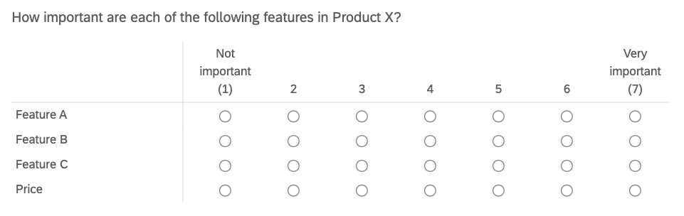
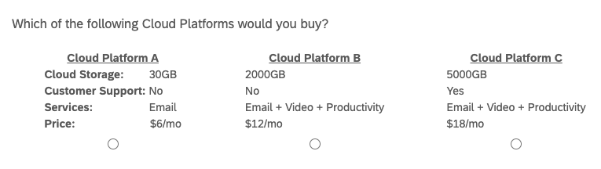

4 Optimize feature sets with Choice-Based Conjoint & Market-Simulators
======================================================================

Similar to Max Diff (see Project [3](Project3.html#Project3)), Choice-Based Conjoint (CBC) has respondents make trade-off decisions between alternatives. In CBC, respondents select which product they prefer from a set of product concepts. These product concepts are defined by unique feature sets and, thus, differentiated from one another. This gives information about how customers value product features and how features and price affect their purchase decisions. A less sophisticated approach to this might capture likert-scale ratings for the constituent features of a product.

  

  

Unfortunately, these likert-scale ratings are often biased. For a number of reasons respondents tend to chose top-box or top-2-box ratings, thus ignoring the bottom half of the scale and exaggerating feature importance. The analyst cannot make actionable design recommendations without feature importance differentiation.

  

Choice-Based Conjoint solves this problem. First of all, it asks questions more closely resembling actual customer decision-making. Product concepts are defined by real feature sets and the customer must chose from a competitive set of products. It’s probably safe to say that customers are more familiar with choosing a product from a set of products than they are at giving numeric ratings for features in terms of importance. Also, CBC lends itself to more sophisticated analyses like market simulators, which allow us to predict the market share that a product will win against a set of competitive products.

  

An example of a CBC question is shown below. The respondent is shown 3 different product profiles (i.e. “alternatives”), each defined by four features (i.e. “attributes”). Each feature has a set of values it can take (e.g. 30GB, 2000GB, 5000GB). The respondents answers a series of these questions with randomly selected alternatives that test different feature permutations. In each case, the respondent is asked to select which product they would buy. Note that some CBC designs present a “None” option in all questions.

  

  

The resulting analysis will give us part-worths, or “utilities”, for each feature level. Utilities represent how valuable, or important, feature levels are to respondents when making purchase decisions. The idea behind “conjoint” is that customers ascribe value to the constituent parts of a product or service. These utilities can be summed for an overall product score and, it is assumed that, the product with the highest score will win the purchase over its competitors.

  
  
  

4.1 Choise-Based Conjoint for Product Design
--------------------------------------------

We are working for a Cloud Services Platform (e.g. Amazon Web Services, Google Cloud, Microsoft Azure) and need to make product design decisions such as core feature-sets, pricing, and tiers of service to optimize revenue or new sign-ups.

To aide our decision-making we will run a Choice-Based Conjoint study for the “B2C Cloud Platform” category. To keep things simple, each Cloud Platform will be defined on three features and price, for a total of four attributes. Based on our competitive analysis, the attributes can take the following values.

  

*   **Cloud Storage:** 30GB / 2000GB / 5000GB
*   **Customer Support:** Yes / No
*   **Services:** Email / Email + Video / Email + Video + Productivity
*   **Price:** $6/mo / $12/mo / $18/mo

  

Note that CBC can support more than four attributes per alternative. “Brand” is another popular attribute that can be included.

  

Finally, our sample needs to consist of users with significant interest in using B2C Cloud Platforms, since CBC tries to simulate their actual purchase decisions. The sample could be split between new users currently searching for their first platform and current users who are willing to switch platforms. An analyst may want to compare CBC results between the two groups on the back-end.

  
  
  

4.2 Experimental Design
-----------------------

When designing CBC studies, the analyst must define [three experimental parameters](https://sawtoothsoftware.com/help/lighthouse-studio/manual/hid_web_whatcbc.html).

  

**1\. How many attributes per product alternative?**  
We have four attributes (3 features & price) per alternative. Experts recommend [6 attributes or less](https://sawtoothsoftware.com/resources/technical-papers/cbc-technical-paper) (Green and Srinivasan [1991](#ref-green_conjoint_1991)). Long attribute lists risk overloading the respondent.

  

**2\. How many product alternatives per question?**  
We will show 3 product alternatives per question. The typical recommendation is 3-5 alternatives (Chapman and Feit [2019](#ref-chapman_r_2019)). Again, we want to avoid presenting the respondent with too much information at once.

  

**3\. How many CBC questions per respondent?**  
We will ask 15 questions per respondent. Experts recommend 10-20 questions (Chapman and Feit [2019](#ref-chapman_r_2019)). CBC questions are more time-consuming and cognitively-intensive than the average multiple-choice question. Respondents may spend 30 seconds to 1 minute on questions in order to evaluate each alternative and make a selection. Understand that asking too many questions will fatigue the respondent and, likely, reduce your data quality.

  

In summary, we will ask 15 CBC questions, each showing 3 product alternatives defined by 4 attributes. These parameters are flexible but have soft limits so that we don’t overload the respondent. Increasing the sample size allows us to reduce CBC questions and alternatives per question, while still capturing a sufficient amount of data.

  

We capture survey responses from 500 respondents. Experts recommend [150-300n at a minimum](https://sawtoothsoftware.com/uploads/sawtoothsoftware/originals/e68ab5a8-5d8c-4587-a5ac-bb6af3a9e7be.pdf) (Orme [2010](#ref-orme_getting_2010)). Note that these sample sizes are adequate for aggregate, population-level utilities; however, other CBC analyses like latent-class segmentation require larger sample sizes.

  

Understand that respondents will not see all of the possible product alternatives. At most, respondents will be shown 45 unique product alternatives (15 questions x 3 alternatives/question) out of 54 total. This brings us to our final research design consideration: how to decide which product alternatives are shown in each question? This is handled with a “random experimental design”, the most common design used in CBC studies. Other experimental designs may be optimal in some scenarios like [“Computer Optimized” and “Fractional Factorial” designs](https://sawtoothsoftware.com/resources/technical-papers/an-overview-and-comparison-of-design-strategies-for-choice-based-conjoint-analysis) (Chrzan and Orme [2000](#ref-chrzan_overview_nodate)).

  
  
  

4.3 Data Collection
-------------------

Random experimental designs draw product alternatives (at random) from the total set of product profiles, with replacement. In our case, we will draw 3 alternatives per question from the total number of product permutations, 54. The code below generates a table of all possible product profiles. Only the last 6 rows are displayed.

  

    attrib <- list(CloudStorage = c("30GB", "2000GB", "5000GB"),
                   CustomerSupport = c("Yes", "No"),
                   CloudServices = c("Email", "Email + Video", 
                                     "Email + Video + Productivity"),
                   Price = c("6", "12", "18"))
    
    tail(expand.grid(attrib))

    ##    CloudStorage CustomerSupport                CloudServices Price
    ## 49         30GB             Yes Email + Video + Productivity    18
    ## 50       2000GB             Yes Email + Video + Productivity    18
    ## 51       5000GB             Yes Email + Video + Productivity    18
    ## 52         30GB              No Email + Video + Productivity    18
    ## 53       2000GB              No Email + Video + Productivity    18
    ## 54       5000GB              No Email + Video + Productivity    18

  

Random experimental designs require randomly generated survey questions. In other words, each respondent will receive a slightly different survey. I recommend using specialty choice-based platforms for this kind of data collection. [Sawtooth Software](https://sawtoothsoftware.com/) is the industry gold-standard. Others are in existence like the [conjoint module on Qualtrics](https://www.qualtrics.com/core-xm/conjoint-analysis/) and [Conjointly](https://conjointly.com/). These specialty products will support the entire work process from experimental design to data collection to back-end analysis; however, I continue in R to show you the inner-workings of a conjoint analysis and in the spirit of open-source.

  
  
  

4.4 Analysis
------------

We will be analyzing our conjoint data with “multinomial logit regression.” I’ve already formatted my raw conjoint data in the requisite “long”, or “stacked”, data format. Refer to this [article](https://docs.displayr.com/wiki/MaxDiff_Data_File_Layouts) to learn more. Note that it is the same format that was used in the Max Diff project.

  

    head(cbc.df)

    ##    resp.id ques alt     type CloudStorage CustomerSupport
    ## 13       1    1   1 personal         30GB             Yes
    ## 20       1    1   2 personal       2000GB             Yes
    ## 39       1    1   3 personal       5000GB             Yes
    ## 4        1    2   1 personal         30GB              No
    ## 54       1    2   2 personal       5000GB              No
    ## 11       1    2   3 personal       2000GB              No
    ##                   CloudServices Price choice
    ## 13 Email + Video + Productivity     6      0
    ## 20                        Email    12      1
    ## 39                        Email    18      0
    ## 4                         Email     6      0
    ## 54 Email + Video + Productivity    18      0
    ## 11                Email + Video     6      1

  

In this data format, each conjoint profile showed to respondents is displayed on its own row. The first three columns are a bit like metadata, showing us respondent ID, question number and position of the alternatives within the questions. As we expect, each question has 3 alternatives. This data set is different than the usual, respondent-level data set where each row corresponds to a unique respondent’s survey answers. CBC generates multiple observations per respondent - in our case, 15 different product selections. Finally, the last column in the dataset is “choice”, representing which product alternative the respondent selected in each question.

  

We can run a “counts analysis” for a quick exploration of the data. Here we count the number of times that attribute levels were selected by the respondent. Remember that this is only valid if attributes were “balanced” during data collection, meaning that each attribute level was shown (approximately) the same number of times as the other levels in that attribute. Our “random experimental design” satisfies this condition, so we proceed with a count analysis.

  

    xtabs(choice ~ Price, data=cbc.df)

    ## Price
    ##    6   12   18 
    ## 3491 2437 1572

    xtabs(choice ~ CloudStorage, data=cbc.df)

    ## CloudStorage
    ##   30GB 2000GB 5000GB 
    ##   1600   2832   3068

    xtabs(choice ~ CustomerSupport, data=cbc.df)

    ## CustomerSupport
    ##  Yes   No 
    ## 4126 3374

    xtabs(choice ~ CloudServices, data=cbc.df)

    ## CloudServices
    ##                        Email                Email + Video 
    ##                         1140                         2353 
    ## Email + Video + Productivity 
    ##                         4007

  

Here we see that the lowest price ($6/mo) is chosen most often. 2000GB and 5000GB cloud storage options were chosen about an equal number of times, but about twice as often as 30GB’s. Customer support is split down the middle and respondents definitely prefer the full cloud services suite (i.e. Email + Video + Productivity) over lighter service options.

  

In summary, respondents want more features at a cheaper price - no surprise here. This is reassuring and a good check for proper data collection. Now we will move on to a more sophisticated, statistical modeling analysis to get a fine-grained understanding of attribute-level importance.

  
  
  

### 4.4.1 Fitting a Choice Model

We will use a “multinomial logit regression” model to estimate the utility values of each attribute level. Our stacked data frame needs to be converted into an indexed data frame compatible with the “mlogit” function. I ran into problems here and needed to revert back to an older version (1.0-1) of the “mlogit” package.

  

    #Get long data frame into proper format for "mlogit" function
    cbc.df.final <- mlogit.data(data = cbc.df, 
                             choice = "choice", 
                             shape = "long", 
                             varying = 5:8,
                             id.var="resp.id",
                             alt.levels=paste("pos",1:3))

  

In terms of the regression equation, “choice” is placed on the left as the dependent variable. On the right, we call all attribute variables in our data frame, as well as a “0” to drop the intercept term from the equation.

  

    m1 <- mlogit(choice ~ 0 + CloudStorage + CustomerSupport + CloudServices + Price, data = cbc.df.final)
    summary(m1)

    ## 
    ## Call:
    ## mlogit(formula = choice ~ 0 + CloudStorage + CustomerSupport + 
    ##     CloudServices + Price, data = cbc.df.final, method = "nr")
    ## 
    ## Frequencies of alternatives:
    ##   pos 1   pos 2   pos 3 
    ## 0.33800 0.32973 0.33227 
    ## 
    ## nr method
    ## 5 iterations, 0h:0m:0s 
    ## g'(-H)^-1g = 4.53E-07 
    ## gradient close to zero 
    ## 
    ## Coefficients :
    ##                                            Estimate Std. Error z-value
    ## CloudStorage2000GB                         1.184015   0.045622  25.953
    ## CloudStorage5000GB                         1.352880   0.046060  29.372
    ## CustomerSupportNo                         -0.490758   0.034801 -14.102
    ## CloudServicesEmail + Video                 1.206194   0.047355  25.471
    ## CloudServicesEmail + Video + Productivity  2.486862   0.052616  47.264
    ## Price12                                   -0.841613   0.041256 -20.400
    ## Price18                                   -1.697608   0.047359 -35.845
    ##                                            Pr(>|z|)    
    ## CloudStorage2000GB                        < 2.2e-16 ***
    ## CloudStorage5000GB                        < 2.2e-16 ***
    ## CustomerSupportNo                         < 2.2e-16 ***
    ## CloudServicesEmail + Video                < 2.2e-16 ***
    ## CloudServicesEmail + Video + Productivity < 2.2e-16 ***
    ## Price12                                   < 2.2e-16 ***
    ## Price18                                   < 2.2e-16 ***
    ## ---
    ## Signif. codes:  0 '***' 0.001 '**' 0.01 '*' 0.05 '.' 0.1 ' ' 1
    ## 
    ## Log-Likelihood: -5592.9

  

Now, each attribute level is assigned a utility, shown by the “Estimate” column. Notice how one attribute level is dropped from each attribute. These are the reference-levels of each attribute and are set equal to zero. The other attribute level utilities are interpreted relative to their corresponding reference level. For example, 2000GB (+1.18) and 5000GB (+1.35) are more attractive than the 30GB (0) option. On the other hand, $18/mo (-1.70) is less attractive than $12/mo (-0.84) and $6/mo (0).

  

These utility values are considered “interval” data that come with specific rules of interpretation. This paper is great in explaining how to [properly interpret conjoint results](https://sawtoothsoftware.com/resources/technical-papers/interpreting-conjoint-analysis-data) (Orme [2010](#ref-orme_getting_2010),). Here are my key take-aways:

  

*   **Utilities must be interpreted relative to each other**  
    Even though $12/mo has a negative utility (-0.84), it doesn’t mean that it is unattractive in absolute terms. Its negative utility just indicates that it is less attractive than the reference-level price of $6/mo.

  

*   **Cannot make direct comparisons between different attributes**  
    For example, we CANNOT say: “2000GB cloud storage \[+1.18\] is more attractive than having customer service \[0\]”

  

*   **Ratio operations not supported**  
    We CANNOT divide one level by another in order to make claims like: “$18/mo is 2x less attractive than $12/mo”)

  

Right now, all attributes are categorical variables, meaning that they have qualitative levels. “mlogit” can handle mixed variable sets (e.g. numeric + categorical) - let’s run a model with price as a numeric variable.

  

    m2 <- mlogit(choice ~ 0 + CloudStorage + CustomerSupport + CloudServices + as.numeric(as.character(Price)), data = cbc.df.final)
    summary(m2)

    ## 
    ## Call:
    ## mlogit(formula = choice ~ 0 + CloudStorage + CustomerSupport + 
    ##     CloudServices + as.numeric(as.character(Price)), data = cbc.df.final, 
    ##     method = "nr")
    ## 
    ## Frequencies of alternatives:
    ##   pos 1   pos 2   pos 3 
    ## 0.33800 0.32973 0.33227 
    ## 
    ## nr method
    ## 5 iterations, 0h:0m:0s 
    ## g'(-H)^-1g = 4.48E-07 
    ## gradient close to zero 
    ## 
    ## Coefficients :
    ##                                             Estimate Std. Error z-value
    ## CloudStorage2000GB                         1.1839507  0.0456204  25.952
    ## CloudStorage5000GB                         1.3528675  0.0460605  29.372
    ## CustomerSupportNo                         -0.4906072  0.0347922 -14.101
    ## CloudServicesEmail + Video                 1.2061872  0.0473556  25.471
    ## CloudServicesEmail + Video + Productivity  2.4868575  0.0526162  47.264
    ## as.numeric(as.character(Price))           -0.1413873  0.0039248 -36.024
    ##                                            Pr(>|z|)    
    ## CloudStorage2000GB                        < 2.2e-16 ***
    ## CloudStorage5000GB                        < 2.2e-16 ***
    ## CustomerSupportNo                         < 2.2e-16 ***
    ## CloudServicesEmail + Video                < 2.2e-16 ***
    ## CloudServicesEmail + Video + Productivity < 2.2e-16 ***
    ## as.numeric(as.character(Price))           < 2.2e-16 ***
    ## ---
    ## Signif. codes:  0 '***' 0.001 '**' 0.01 '*' 0.05 '.' 0.1 ' ' 1
    ## 
    ## Log-Likelihood: -5592.9

  

Changing “Price” to a numeric variable reduced the total number of attribute levels in our output, making for a more parsimonious model overall. We can test to see how well this new model fits the data relative to our first model with a Likelihood Ratio test. It tests the hypothesis that “m2” fits the data better than “m1”.

  

    lrtest(m1, m2)

    ## Likelihood ratio test
    ## 
    ## Model 1: choice ~ 0 + CloudStorage + CustomerSupport + CloudServices + 
    ##     Price
    ## Model 2: choice ~ 0 + CloudStorage + CustomerSupport + CloudServices + 
    ##     as.numeric(as.character(Price))
    ##   #Df  LogLik Df  Chisq Pr(>Chisq)
    ## 1   7 -5592.9                     
    ## 2   6 -5592.9 -1 0.0392      0.843

  

Considering the large p-value above, we fail to reject the null hypothesis - both models fit the data equally well. We will continue with “m2” since it has a simpler regression equation than “m1”.

  
  
  

### 4.4.2 Willingness to Pay

Usually, the main output of a conjoint analysis is a market simulator and sensitivity plot (shown later on); however, “willingness-to-pay” can be used as a secondary analysis - it can be used to show the monetary value that customers ascribe to attribute levels. Simply, divide utilities by the price utility.

  

    round(coef(m2)["CloudStorage2000GB"]/(-coef(m2)["as.numeric(as.character(Price))"]), 2)

    ## CloudStorage2000GB 
    ##               8.37

    round(coef(m2)["CloudStorage5000GB"]/(-coef(m2)["as.numeric(as.character(Price))"]), 2)

    ## CloudStorage5000GB 
    ##               9.57

    round(coef(m2)["CustomerSupportNo"]/(-coef(m2)["as.numeric(as.character(Price))"]), 2)

    ## CustomerSupportNo 
    ##             -3.47

    round(coef(m2)["CloudServicesEmail + Video"]/(-coef(m2)["as.numeric(as.character(Price))"]), 2)

    ## CloudServicesEmail + Video 
    ##                       8.53

    round(coef(m2)["CloudServicesEmail + Video + Productivity"]/(-coef(m2)["as.numeric(as.character(Price))"]), 2)

    ## CloudServicesEmail + Video + Productivity 
    ##                                     17.59

  

The interpretation here is that: “2000GB of cloud storage can command an $8.37/mo premium over 30GB of cloud storage, all other attributes being held equal.” In other words, if a customer is given the choice between 30GB and 2000GB (with all other features identical), and the 2000GB option is less than $8.37/mo more than the 30GB option, then we would expect the customer to purchase the 2000GB option.

  
  
  

### 4.4.3 Preference Share Simulator

Preference share prediction is the most common analysis in conjoint projects. The analyst creates a theoretical competitive market by selecting specific product alternatives from the total profile list. These alternatives will now compete with each other in a simulated market environment, and the choice model predicts the share of the market that each product will win.

  

Be careful when reporting these results. Our model was created by simulating customer purchase decisions in a survey - it’s not difficult to think of external, real-world factors that our model does not account for; therefore, we present these predictions as “preference shares”. Experts have found that [preference shares are directionally accurate to real-world market share](https://sawtoothsoftware.com/resources/technical-papers/introduction-to-market-simulators-for-conjoint-analysis) (Orme [2010](#ref-orme_getting_2010)). This means that, while the absolute value of a preference share may not match actual market share, we can still confidently predict which products will do better than others.

  

The first step is to create our hypothetical market. We select 6 competitive products from the total profile list, and predict the preference share of each. Let’s pretend that our product offering is row 16 (3rd from top).

  

    comp.universe <- expand.grid(attrib)[c(4, 10, 16, 35, 51, 53),]
    comp.universe

    ##    CloudStorage CustomerSupport                CloudServices Price
    ## 4          30GB              No                        Email     6
    ## 10         30GB              No                Email + Video     6
    ## 16         30GB              No Email + Video + Productivity     6
    ## 35       2000GB              No Email + Video + Productivity    12
    ## 51       5000GB             Yes Email + Video + Productivity    18
    ## 53       2000GB              No Email + Video + Productivity    18

  

Now, we must define a custom predict function for choice-based simulation. Remember the foundational premise behind “conjoint” - products are made up of constituent features that customers ascribe value to. We now have the “value” ascribed to each feature level - these are the utilities. Now we can add the utilities together, across a product’s attribute levels and come up with a total score for each product profile above. Calculating the “share of preference” is simply a product’s utility score divided by the sum of all products’ utility scores. The function below carries out this calculation.

  

    # Predicting shares - adapted from Chapman & Feit (2015)
    predict.mnl <- function(model, data) {
            data.model <- model.matrix(update(model$formula, 0 ~ .), data = data)[,-1]
            utility <- data.model%*%model$coef
            share <- round(exp(utility)/sum(exp(utility)),2)
            cbind(share, data)
    }
    
    predict.mnl(m2, comp.universe)

    ##    share CloudStorage CustomerSupport                CloudServices Price
    ## 4   0.02         30GB              No                        Email     6
    ## 10  0.06         30GB              No                Email + Video     6
    ## 16  0.22         30GB              No Email + Video + Productivity     6
    ## 35  0.31       2000GB              No Email + Video + Productivity    12
    ## 51  0.26       5000GB             Yes Email + Video + Productivity    18
    ## 53  0.13       2000GB              No Email + Video + Productivity    18

  

We can rank order the products from greatest to least preference share - this is our proxy for market share. For example, we would expect Product 35 (with 31% preference share) to win more market share than Product 53 (with 13% preference share).

  

Product 16, our Cloud Platform, did relatively well, coming in third place and capturing 22% of preference. The analyst can play around with the competitive product set to see how Product 16 performs in other markets. Also, the analyst can simulate product line extensions. By adding an additional product into the market, you can recalculate preference share and measure cannibalization effects, if any.

  

After simulating your current, or future, product in a market, the next natural question is: “How can we optimize our product to maximize market share?” This is where sensitivity plots come in.

  

### 4.4.4 Sensitivity Plot

With a sensitivity plot, the analyst can see how changing the levels of a feature, one at a time, will affect the share of a baseline product.

  

    # Share sensitivity - adapted from Chapman & Feit (2015)
    sensitivity.plot <- function(model, attrib, base.data, competitor.data) {
      data <- rbind(base.data, competitor.data)
      base.share <- predict.mnl(model, data)[1, 1]
      share <- NULL
      for (a in seq_along(attrib)) {
        for (i in attrib[[a]]) {
          data[1,] <- base.data
          data[1,a] <- i
          share <- c(share, predict.mnl(model, data)[1, 1])
        }
      }
      data.frame(level=unlist(attrib), share=share, increase=share-base.share)
    }

  

    base.data <- expand.grid(attrib)[c(16), ]
    competitor.data <- expand.grid(attrib)[c(4, 10, 35, 51, 53), ]
    tradeoff <- sensitivity.plot(m2, attrib, base.data, competitor.data)

  

Let’s say, as a product manager, we have our assumptions about the features to include in an initial product release, or maybe we already have this product on the market. This is our “baseline product”. The sensitivity plot below shows the changes in share that we would expect from changes to feature levels or price.

  

    barplot(tradeoff$increase, horiz=FALSE, names.arg=tradeoff$level,
            ylab="Change in Share for Baseline Product")

  

We see that, everything else being held equal, increasing the cloud storage from 30GB to 2000GB we would expect our product to capture over 25% more preference share. This is an incredible increase, but remember, we would only expect this increase in preference share if we hold price, and all other features, equal. Increasing to amount of cloud storage may not be economically feasible for the company at only $6/mo.

  

Check out the “Customer Service” variable. Our baseline product does not offer customer service. But, by offering it, we would expect a 10% increase in share. The analyst can perform some quick feasibility calculations by multiplying total market cap by 10%. If this exceeds the company’s cost in offering Customer Service to this user base, then the company may consider this addition.

  
  
  

4.5 Conclusion
--------------

We designed a Choice-Based Conjoint study with product alternatives defined on 4 attributes and a random experimental design as a our method for data-collection. CBC lends itself to several analyses like counts and willingness-to-pay; however, choice-based models are usually the main analysis in these studies and result in preference share simulators and sensitivity plots. These simulators allow analysts to test their product concept in a hypothetical market environment and predict its performance in the market relative to its competitors. Sensitivity plots show how changes to price and feature sets can optimize performance in these hypothetical markets.

  

We fit a multinomial logit regression model to our stacked, and indexed, CBC dataset. [Other statistical models](https://sawtoothsoftware.com/help/lighthouse-studio/manual/hid_web_whatcbc.html) can be used for more sophisticated analyses, such as “Latent Class Multinomial Logit” for segmenting the sample based on preferences, or “Hierarichal Bayes” for respondent-level utility estimation.

  

Latent Class segmentation identifies “hidden” customer groups with differing product preferences. This analysis can help identify segments for which niche product offerings appeal - it allows for more fine-grained product targeting. See Project [2](Project2.html#Project2) for user segmentation, based on user attitudes and product usage, using a convergent K-Means clustering algorithm.

  

Hierarichal Bayes is a Bayesian modeling technique that estimates utilities for each respondent. This can add precision to aggregate utility estimation by accounting for preference heterogeneity between respondents. It also accounts for interaction effects (between attribute levels). We did not include interaction terms in our models - they must be explicitly included in the model equation.

  

Finally, “brand” is often included as a product attribute. One can imagine the differences in soda brand utility between Coca-Cola, Pepsi, and Virgin Cola. Including “brand” and “price”, along with other attributes, can be used to generate [price sensitivity curves and calculate the price elasticity of products](https://sawtoothsoftware.com/resources/technical-papers/understanding-the-value-of-conjoint-analysis) (Orme [2010](#ref-orme_getting_2010)). See Project [5](Project5.html#Project5) for more about price optimization techniques.

### Bibliography

Chapman, C, and E Feit. 2019. _R for Marketing Research and Analytics_. New York, NY: Springer Berlin Heidelberg.

Chrzan, Keith, and Brian Orme. 2000. “An Overview and Comparison of Design Strategies for Choice-Based Conjoint Analysis(2000).” _Sawtooth Software_. [https://sawtoothsoftware.com/resources/technical-papers/an-overview-and-comparison-of-design-strategies-for-choice-based-conjoint-analysis](https://sawtoothsoftware.com/resources/technical-papers/an-overview-and-comparison-of-design-strategies-for-choice-based-conjoint-analysis).

Green, Paul, and V Srinivasan. 1991. “Conjoint Analysis in Marketing Research: New Developments and Directions.” _Journal of Product Innovation Management_ 8 (3): 225. [https://doi.org/10.1016/0737-6782(91)90041-V](https://doi.org/10.1016/0737-6782(91)90041-V).

Orme, Bryan K. 2010. _Getting Started with Conjoint Analysis: Strategies for Product Design and Pricing Research_. 2. ed. Madison, Wis: Research Publ.