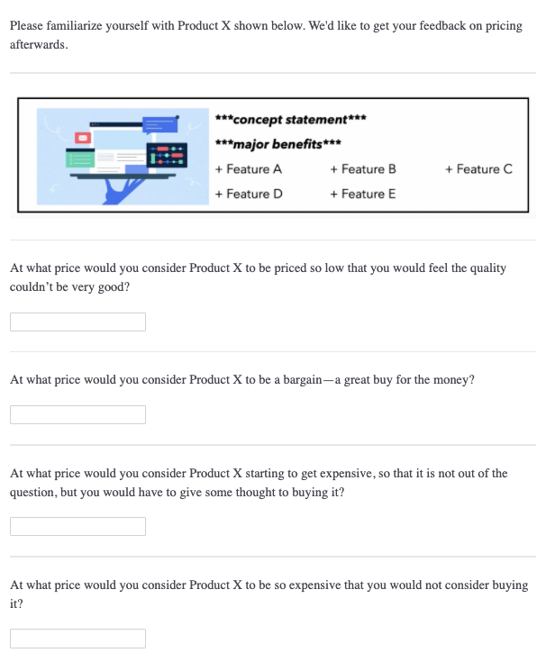
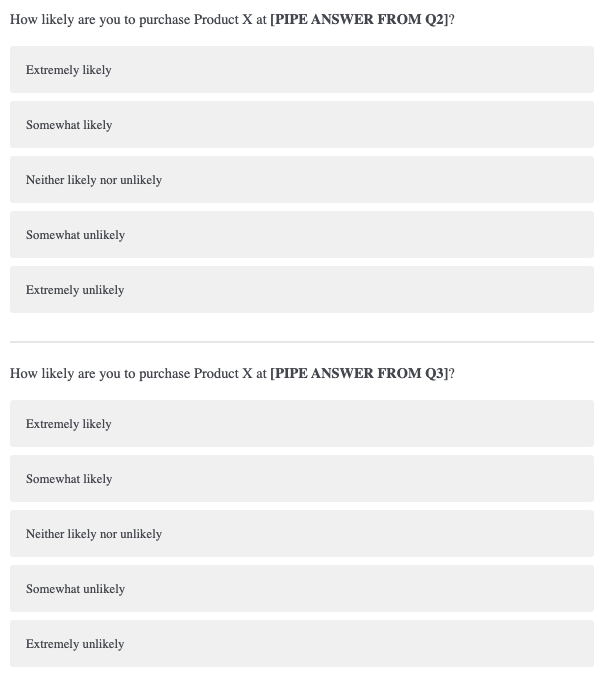

# Maximize adoption and revenue with the Price Sensitivity Meter {#Project5}

```{r 03.0, include = FALSE}
knitr::opts_chunk$set(echo = TRUE)
library(pricesensitivitymeter)
library(ggplot2)

dat <- read.csv(file = "./data/03_dat.csv", header = TRUE, fileEncoding = "iso-8859-1")

names(dat) <- c("Too cheap", "Cheap", "Expensive", "Too expensive", "Likelihood To Buy: Cheap", "Likelihood To Buy: Expensive")
```

A dutch social scientist, named Van Westendorp, originally created the Price Sensitivity Meter (PSM) in the 1970's. He demonstrated its use in determining the acceptable price range and optimal price point of products [@van_westendorp_nss-price_1976]. Newton, Miller, Smith extended the PSM in the 1990's with two follow-up questions that can be used to generate product demand curves and revenue curves for further price optimization [@newton_market_1993].

<br>

These price optimization techniques are good for testing the team's price assumptions before going to market, especially if there is little to no data for what an acceptable price range might be. A pre-defined product is needed because respondents must first understand the product concept, it's feature-set and value proposition; therefore, the respondent is shown the product concept before capturing their pricing feedback [@qualtrics_how_2021].

<br>

On the other hand, Choice-Based Conjoint Analysis (see Project \@ref(Project4)) can be used in earlier stages of product development, when the feature-set has yet to be established. With Choice-Based Conjoint you can determine optimal feature-sets and pricing tiers all at once, as well as price sensitivity curves and price elasticity; however, for CBC studies, the survey length is considerably longer, and the data collection and analysis is much more complicated than PSM studies.

<br> <br> <br>

## Introduction
We are the product manager of Product X. Its feature set has been defined, but the product category is nascent - there is no secondary market research data or competitors on which to base our pricing. We need to get an approximate range of acceptable prices for the market we are entering. While the dev team continues the build, we give a survey to 1000 target customers to gauge their price expectations for Product X and help us refine our go-to-market strategy.

<br> <br> <br>

## Data Collection
All necessary data for PSM, and its extension, can be captured with a short and simple survey. The PSM only requires four separate survey questions shown below. First, introduce the product concept - quickly discuss its value proposition and key features. Then, ask a series of four questions.

<br>
<center>

</center>
<br>

The first question captures the product price that the respondent thinks is "too cheap", which makes him/her concerned over product quality. The second question captures the product price that the respondent thinks is "cheap", and thus feels he/she is getting a good deal. The third question captures the product price that the respondent thinks is "expensive" - it wouldn't prohibit him/her from buying, but he/she would feel some hesitation. Finally, the fourth question captures the product price that the respondent thinks is "too expensive" and cannot justify the purchase.

<br>

A couple of thoughts here for survey programming. First, we use fill-in-the-blank question types. This is so we don't limit the respondents to a pre-specified price range. The purpose of a PSM study is to gauge how customers value your product. If it's a new category, or a highly unique product, respondents may give a large range of prices (i.e. high variance). That's okay - we can always discard extreme outliers in our back-end analysis. Remember to only accept numeric responses in these fields.

<br>

Having said that, the slider question type works well here and likely improves the respondent experience. Just know that you will have to pre-specify a price range and also consider the price step-size for intervals on the slider. Theoretically, when using a slider question type, you are reducing the amount of information collected, or "reducing pricing precision". Larger price ranges mean larger step sizes, so just make sure that respondents have enough precision to give their responses on the sliders you provide.

<br>

Finally, it's possible to add survey logic that requires respondents to increase the price for each subsequent PSM question. This is an assumption in PSM, that Q1 < Q2 < Q3 < Q4. The PSM model doesn't make sense without this condition. With survey logic, an error will be returned if the response is less than or equal to the previous response. Or, you don't have to use survey logic, and just handle this PSM condition in the back-end. 

<br>

There is an added benefit to discarding these respondents on the back-end. It serves as an attention check. Those who fail to meet this condition likely weren't giving good responses to begin with. We lose 1% of our total sample size (9 respondents) by discarding these respondents in our back-end analysis.

<br>

If you wish to include the Newton Miller Smith extension, then the two questions below should directly follow the questions shown above.

<br>
<center>

</center>
<br>

The first question pipes in the respondent's price given in Q2, corresponding to "cheap". The second question pipes in his/her Q3 response, corresponding to "expensive". We are trying to capture a respondent's likelihood to purchase a product at the "cheap" and "expensive" price points. This data will be used to generate demand and revenue curves, shown later on. 

<br> <br> <br>

## Analysis
Our analysis contains two parts: Van Westendorp's PSM and Newton Miller Smith extension. Van Westendorp's PSM generates a data visual that nicely summarizes all important points. The Newton Miller Smith extension generates demand curves for user adoption and product revenue. The two analyses are a complement to each other and give the analyst several optimal price points to chose from. Quickly we reformat the two Newton Miller Smith questions below.

<br>

```{r 03.1}
dat[,5] <- as.factor(dat[,5])
levels(dat[,5]) <- c(4,3,2,5,1)
dat[,5] <- as.numeric(as.character(dat[,5]))

dat[,6] <- as.factor(dat[,6])
levels(dat[,6]) <- c(4,3,2,5,1)
dat[,6] <- as.numeric(as.character(dat[,6]))
```

<br>

### Acceptable Price Range and Optimal Price Point (OPP)
The "pricesensitivitymeter" package is a great out-of-box solution for analyzing our pricing data. We simply pass the four numeric vectors, generated by the four Van Westendorp survey questions, to the corresponding categories ("too cheap", "cheap", "expensive", "too expensive") in the function below. The function also has pre-specified fields ("pi_cheap", "pi_expensive") for the likelihood to purchase questions, part of the Newton Miller Smith extension. This means that, with one single function, we generate all necessary data for the classic Van Westendorp visualization, as well as two other price optimization visualizations: one optimizing for product adoption and the other optimizing for revenue.   

<br>

```{r 03.2}
psm_out <- psm_analysis(toocheap = dat[,1], 
             cheap = dat[,2], 
             expensive = dat[,3],
             tooexpensive = dat[,4],
             validate = TRUE,
             pi_cheap = dat[,5],
             pi_expensive = dat[,6])

str(psm_out)
```

<br>

The function outputs an R object, which we've named "psm_out". Its internal structure is printed above. We will use this object as our data source for the rest of our analyses and visualizations. Let's now step through the important components of this object one-by-one to discuss what they are and how they will be used.

<br>

```{r 03.3}
head(psm_out$data_input)
```

<br>

The table above shows the raw Van Westendorp data used in subsequent calculations. We originally passed the function a data set with 1000n, yet this data set only contains 991n. This is because 9 respondents' answers to the Van Westendorp questions do not meet validity assumptions - that "too cheap" < "cheap" < "expensive" < "too expensive". These respondents were discarded since the "validate" argument was set to TRUE. 

<br>

Also, two new variables were added, "pi_cheap_cal" and "pi_expensive_cal". These are for the Newton Smith Miller extension and are proxies for purchase probability based on respondent answers to the likelihood to purchase questions. Purchase probabilities are assigned based on the following assumption: ("Very unlikely" = 0%  /  "Unlikely" = 10%  /  "Neither likely nor unlikely" = 30%  /  "Likely" = 50%  /  "Very likely" = 70%). Probabilities can be changed from this default assumption, but we proceed with the default values.

<br>

```{r 03.4}
head(psm_out$data_vanwestendorp)
```

<br>

This is the function's main output. "Price" shows all the price values present in the input data. In this case, it ranges from \$10 to \$200. The "ecdf" variables show the cumulative distribution function values at each price.

<br>

The "ecdf" values represent the fraction, or proportion, of respondents. One can see that "ecdf_toocheap" and "ecdf_cheap" count down and the "ecdf_expensive" and "ecdf_tooexpensive" count up. In other words they are inverted from one another. The other two variables are calculated last. "ecdf_not_cheap" is calculated by 1 - (ecdf_cheap) and "ecdf_not_expensive" is calculated by 1 - (ecdf_expensive). Let's delve deeper, taking the $75 price as an example for how to interpret these "ecdf" variables.

<br>

```{r 03.5}
psm_out$data_vanwestendorp[psm_out$data_vanwestendorp[,] == 75,]
```

<br>

- **ecdf_toocheap:** "\$75 or less is considered too cheap by 3% of respondents."
- **ecdf_cheap:** "\$75 or less is considered cheap by 16% of respondents."
- **ecdf_expensive:** "\$75 or more is considered expensive by 37% of respondents."
- **ecdf_tooexpensive:** "\$75 or more is considered too expensive by 9% of respondents."
<br>
- **ecdf_not_cheap:** "\$75 or more is considered not cheap by 84% of respondents."
- **ecdf_not_expensive:** "\$75 or less is considered not expensive by 63% of respondents."

<br>

Just note that four of these distributions will be plotted in the classic Van Westendorp visualization to follow.
 
<br>

```{r 03.6}
list("Price Range Lower" = psm_out$pricerange_lower, "Price Range Lower Upper" =psm_out$pricerange_upper, "Indifference Price Point" = psm_out$idp, "Optimal Price Point" = psm_out$opp)
```
<br>

Again, the above values were pulled from the "psm_out" object - these are the main results for a PSM analysis.

<br>

- **Price Range: Lower**
<br>
Also known as the "Point of Marginal Cheapness" (MGP). This is the lowest you would want to price your product. Below this point and more respondents consider the price as "too cheap" than "not cheap".

<br>

- **Price Range: Upper**
<br>
Also known as the "Point of Marginal Expensiveness" (MEP). This is the highest you would want to price your product. Above this point and more respondents consider the price as "too expensive" than "not expensive". Thus, our range of acceptable prices is \$40 - \$98.

<br>

- **Indifference Price Point (IDP)**
<br>
An equal proportion of respondents consider the price as "cheap" and "expensive". 

<br>

- **Optimal Price Point (OPP)**
<br>
An equal proportion of respondents consider the price as "too cheap" and "too expensive". It's considered an "optimal" price because it's argued that customers have the least amount of purchase resistance here.

<br>

The four points described above represent where the cumulative distributions intersect on the Van Westendorp visualization below.

<br>

```{r 03.7, fig.align="center"}
psmplot <-  ggplot(data = psm_out$data_vanwestendorp, aes(x = price)) +
  annotate(geom = "rect", # shaded background area for range of acceptable prices
           xmin = psm_out$pricerange_lower,
           xmax = psm_out$pricerange_upper,
           ymin = 0, ymax = Inf,
           fill="grey50", alpha = 0.3) +
  geom_line(aes(y = ecdf_toocheap, # line: too cheap
                colour = "too cheap",
                linetype = "too cheap"),
            size= .5) +
  geom_line(aes(y = ecdf_tooexpensive, # line: too expensive
                colour = "too expensive",
                linetype = "too expensive"),
            size = .5) + 
  geom_line(aes(y = ecdf_not_cheap, # line: not cheap
                colour = "not cheap",
                linetype = "not cheap"),
            size = .5) +
  geom_line(aes(y = ecdf_not_expensive, # line: not expensive
                colour = "not expensive",
                linetype = "not expensive"),
            size = .5) + 
  annotate(geom = "point", # Indifference Price Point (intersection of "cheap" and "expensive")
           x = psm_out$idp, 
           y = psm_out$data_vanwestendorp$ecdf_not_cheap[psm_out$data_vanwestendorp$price == psm_out$idp],
           size = 3,
           shape = 2,
           colour = "#D55E00",
           fill = "#D55E00",
           alpha = .8) + 
  annotate(geom = "point", # Optimal Price Point (intersection of "too cheap" and "too expensive")
           x = psm_out$opp, 
           y = psm_out$data_vanwestendorp$ecdf_toocheap[psm_out$data_vanwestendorp$price == psm_out$opp],
           size = 3,
           shape = 2,
           colour = "#D55E00",
           fill = "#D55E00",
           alpha = 0.8)


# Update plot with labels and colors
psmplot +
  labs(x = "Price",
       y = "Proportion of Respondents",
       title = "Price Sensitivity Plot for Product X",
       caption = paste("sample size:",
                       psm_out$total_sample - psm_out$invalid_cases,
                       "respondents"))  + 
  scale_colour_manual(name = "Legend",
                      values = c("too cheap" = "#040453",
                                 "not cheap" = "#040453",
                                 "not expensive" = "#00b0f0",
                                 "too expensive" = "#00b0f0")) + 
  scale_linetype_manual(name="Legend",
                        values = c("too cheap" = "dotted",
                                   "not cheap" = "solid",
                                   "not expensive" = "solid",
                                   "too expensive" = "dotted")) + 
  annotate(geom = "text", # Label of Indifference Price Point
           x = psm_out$idp + 5, 
           y = psm_out$data_vanwestendorp$ecdf_not_cheap[psm_out$data_vanwestendorp$price == psm_out$idp] + .05,
           label = paste("IDP: ", psm_out$idp)) + 
  annotate(geom = "text", # Label of Optimal Price Point
           x = psm_out$opp,
           y = psm_out$data_vanwestendorp$ecdf_toocheap[psm_out$data_vanwestendorp$price == psm_out$opp] + .05,
           label = paste("OPP: ", psm_out$opp)) +
  theme_minimal()
```

<br>

Looking above the grey shaded region represents the acceptable price range for Product X, where the lower bound (MGP) is defined by the intersection point between the "too cheap" and "not cheap" distributions and the upper bound (MEP) defined by the intersection point between the "too expensive" and "not expensive" distributions.

<br>

The "optimal price point" (OPP) and "indifference price point" (IDP) are displayed above. They represent the intersection between the "too cheap" and "too expensive" distribution, and the intersection between the "not cheap" and "not expensive" distribution, respectively. This is a great visual to show stakeholders for summarizing PSM results.

<br>

### Optimizing for User Adoption & Product Revenue
The last parts of the "psm_out" object that we discuss are related to the Newton Miller Smith extension. Newton Miller Smith extended the PSM with two follow-up purchase intent questions at the cheap and expensive price points. Then, likelihood to purchase is converted into a purchase probability on the back-end, which we already discussed towards the beginning of the previous section. The purchase likelihood at a respondent's "too cheap" and "too expensive" price levels are taken as 0 - the product is either prohibitively expensive for him/her or he/she is too concerned with the quality of the product at such a cheap price.

<br>

Now we have a purchase probability for each respondent at each price point, which allows for two additional analyses: product adoption and product revenue curves. The data below are used to generate these two curves. In the "trial" column, the purchase probability, averaged across all respondents, is shown at each price point. The maximum here corresponds to the price that maximizes product adoption. The "revenue" column simply multiplies this mean purchase probability by the corresponding price. The maximum here corresponds to the price that maximizes product revenue.

<br>

```{r 03.8}
head(psm_out$data_nms)
```

<br>

Finally, the "psm_out" object stores the prices at which these maximums occur.

<br>

```{r 03.9}
list("Price for Maximum Adoption" = psm_out$price_optimal_trial, "Price for Maximum Revenue" = psm_out$price_optimal_revenue)
```

<br>

These two price points represent demand curve maximums on the visualizations below.

<br>

```{r 03.10, fig.align="center"}
# Plot for Optimal User Adoption
ggplot(data = psm_out$data_nms, aes(x = price)) + 
  geom_line(aes(y = trial), color = "#040453") + # trial curve
  geom_vline(xintercept = psm_out$price_optimal_trial,
             linetype = "dotted", color = "#00b0f0") + # highlighting the optimal price
  geom_text(data = subset(psm_out$data_nms, trial == max(trial)),
            aes(x = price + 0.5, y = trial),
            label = paste("Optimal Price:", psm_out$price_optimal_trial),
            hjust = 0) + # labeling the optimal price
  labs(x = "Price", y = "Avg. Purhcase Probability",
       title = "Price for Maximum User Adoption", caption = paste("sample size:",
                       psm_out$total_sample - psm_out$invalid_cases,
                       "respondents")) +
theme_minimal()
```

<br> 

```{r 03.11, fig.align="center"}
# Plot for Optimal Revenue
ggplot(data = psm_out$data_nms, aes(x = price)) + 
    geom_line(aes(y = revenue), color = "#040453") + # revenue curve
  geom_vline(xintercept = psm_out$price_optimal_revenue,
             linetype = "dotted", color = "#00b0f0") + # highlighting the optimal price
  geom_text(data = subset(psm_out$data_nms, revenue == max(revenue)),
            aes(x = price + 0.5, y = revenue),
            label = paste("Optimal Price:", psm_out$price_optimal_revenue),
            hjust = 0) + # labeling the optimal price
  labs(x = "Price", y = "Revenue",
       title = "Price for Maximum Product Revenue",
       caption = paste("sample size",
                       psm_out$total_sample - psm_out$invalid_cases,
                       "respondents")) +
  theme_minimal()
```

<br> <br> <br>

## Conclusion
We calculated the "optimal product price" (OPP) in our PSM analysis to be \$70, which is the price with the lowest purchase resistance. Acceptable prices for the product range from \$40 to \$98. Also, the Newton Miller Smith extension shows that pricing our product at \$61 will maximize user adoption and pricing our product at \$76 will maximize product revenue.

<br>

There are other price optimization techniques like Gabor Grangor and Choice-Based Conjoint. Gabor Grangor price optimization is slightly more direct than PSM. It asks respondents if they would buy the Product at a specific price point, only giving them a "yes" or "no" answer choice. If the respondent selects "yes" then the price is incrementally increased and the question is asked again for the new price point. This continues until the respondent selects "no", that they would not purchase the product at that price. If the respondent selects "no" on the first question, then the subsequent questions incrementally decrease the initial price until the respondent selects "yes". This type of questioning reveals the maximum price a customer is willing to pay for a product. This analysis also generates demand curves for user adoption and product revenue maximization. Note that data collection is more complicated than in PSM and the analyst must pre-specify a price range from the beginning.

<br>

Again, as stated above, Choice-Based Conjoint (see Project \@ref(Project4)) can be used for price optimization as well, but it is a much more complex technique. Having said that, it's the ideal option when the analyst seeks to optimize feature sets and pricing tiers all in the same study.