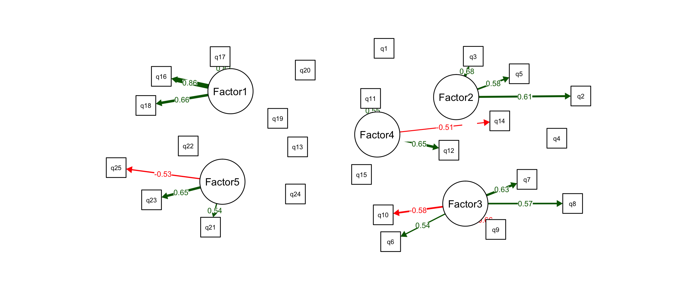
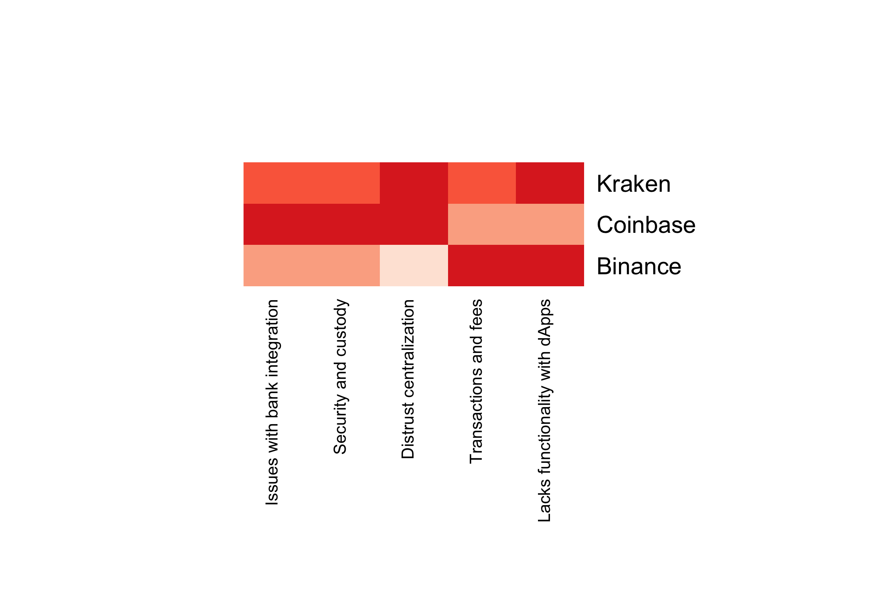
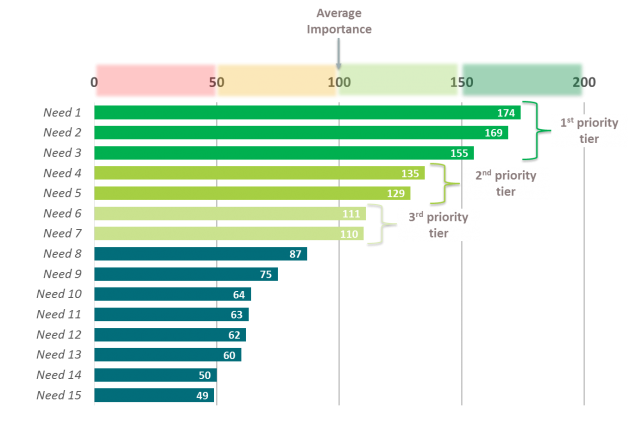
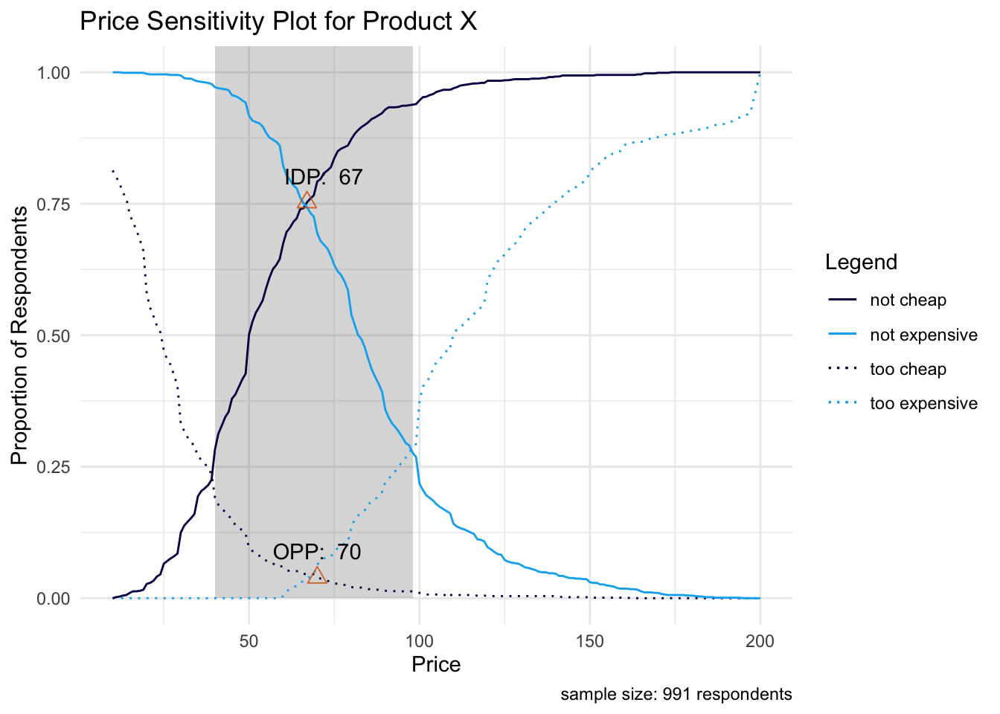
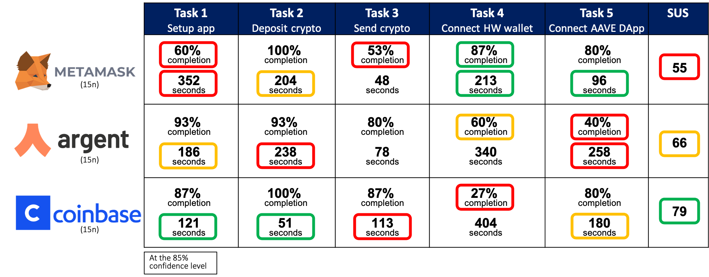
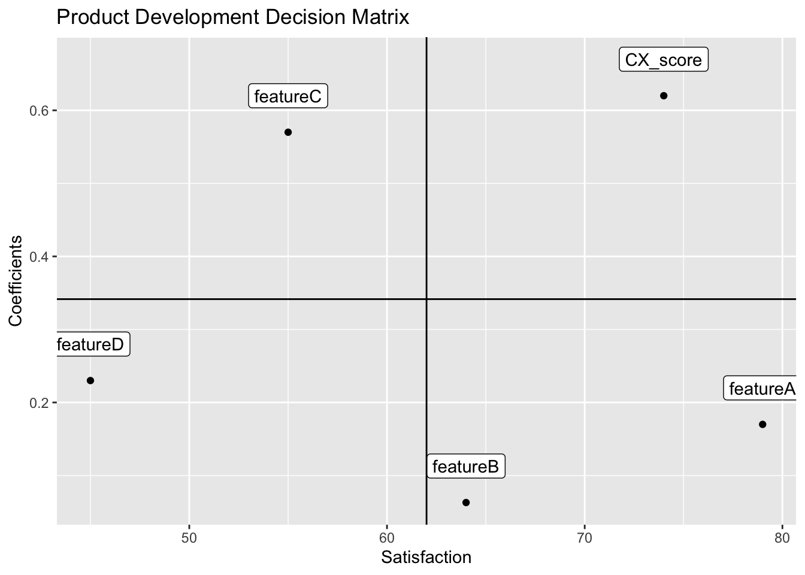

  Data Science for Human-Centered Product Design                    code.sourceCode > span { display: inline-block; line-height: 1.25; } code.sourceCode > span { color: inherit; text-decoration: inherit; } code.sourceCode > span:empty { height: 1.2em; } .sourceCode { overflow: visible; } code.sourceCode { white-space: pre; position: relative; } pre.sourceCode { margin: 0; } @media screen { div.sourceCode { overflow: auto; } } @media print { code.sourceCode { white-space: pre-wrap; } code.sourceCode > span { text-indent: -5em; padding-left: 5em; } } pre.numberSource code { counter-reset: source-line 0; } pre.numberSource code > span { position: relative; left: -4em; counter-increment: source-line; } pre.numberSource code > span > a:first-child::before { content: counter(source-line); position: relative; left: -1em; text-align: right; vertical-align: baseline; border: none; display: inline-block; -webkit-touch-callout: none; -webkit-user-select: none; -khtml-user-select: none; -moz-user-select: none; -ms-user-select: none; user-select: none; padding: 0 4px; width: 4em; color: #aaaaaa; } pre.numberSource { margin-left: 3em; border-left: 1px solid #aaaaaa; padding-left: 4px; } div.sourceCode { } @media screen { code.sourceCode > span > a:first-child::before { text-decoration: underline; } } code span.al { color: #ff0000; font-weight: bold; } /\* Alert \*/ code span.an { color: #60a0b0; font-weight: bold; font-style: italic; } /\* Annotation \*/ code span.at { color: #7d9029; } /\* Attribute \*/ code span.bn { color: #40a070; } /\* BaseN \*/ code span.bu { } /\* BuiltIn \*/ code span.cf { color: #007020; font-weight: bold; } /\* ControlFlow \*/ code span.ch { color: #4070a0; } /\* Char \*/ code span.cn { color: #880000; } /\* Constant \*/ code span.co { color: #60a0b0; font-style: italic; } /\* Comment \*/ code span.cv { color: #60a0b0; font-weight: bold; font-style: italic; } /\* CommentVar \*/ code span.do { color: #ba2121; font-style: italic; } /\* Documentation \*/ code span.dt { color: #902000; } /\* DataType \*/ code span.dv { color: #40a070; } /\* DecVal \*/ code span.er { color: #ff0000; font-weight: bold; } /\* Error \*/ code span.ex { } /\* Extension \*/ code span.fl { color: #40a070; } /\* Float \*/ code span.fu { color: #06287e; } /\* Function \*/ code span.im { } /\* Import \*/ code span.in { color: #60a0b0; font-weight: bold; font-style: italic; } /\* Information \*/ code span.kw { color: #007020; font-weight: bold; } /\* Keyword \*/ code span.op { color: #666666; } /\* Operator \*/ code span.ot { color: #007020; } /\* Other \*/ code span.pp { color: #bc7a00; } /\* Preprocessor \*/ code span.sc { color: #4070a0; } /\* SpecialChar \*/ code span.ss { color: #bb6688; } /\* SpecialString \*/ code span.st { color: #4070a0; } /\* String \*/ code span.va { color: #19177c; } /\* Variable \*/ code span.vs { color: #4070a0; } /\* VerbatimString \*/ code span.wa { color: #60a0b0; font-weight: bold; font-style: italic; } /\* Warning \*/ 

*   [Introduction](index.html)
*   [**1** Reveal patterns among user needs with Factor Analysis](Project1.html)
    *   [**1.1** Factor Analysis for Product Design](Project1.html#factor-analysis-for-product-design)
    *   [**1.2** Data Collection](Project1.html#data-collection)
    *   [**1.3** Analysis](Project1.html#analysis)
        *   [**1.3.1** Estimate Number of Factors](Project1.html#estimate-number-of-factors)
        *   [**1.3.2** Factor Model](Project1.html#factor-model)
    *   [**1.4** Factor Scores by Brand for Market Gap Analysis](Project1.html#factor-scores-by-brand-for-market-gap-analysis)
    *   [**1.5** Conclusion](Project1.html#conclusion)
*   [**2** Identify target user segments with ML Clustering & Classification](Project2.html)
    *   [**2.1** Market Segmentation for Product Design](Project2.html#market-segmentation-for-product-design)
    *   [**2.2** Data Collection](Project2.html#data-collection-1)
    *   [**2.3** Segmentation Analysis](Project2.html#segmentation-analysis)
        *   [**2.3.1** Check Data Clumpiness](Project2.html#check-data-clumpiness)
        *   [**2.3.2** Predict Number of Clusters](Project2.html#predict-number-of-clusters)
        *   [**2.3.3** K-Means Clustering](Project2.html#k-means-clustering)
        *   [**2.3.4** Segment Comparisons with Crosstabs](Project2.html#segment-comparisons-with-crosstabs)
        *   [**2.3.5** Cluster Reproducibility](Project2.html#cluster-reproducibility)
        *   [**2.3.6** Final Segment Solution](Project2.html#final-segment-solution)
    *   [**2.4** Typing Tool](Project2.html#typing-tool)
        *   [**2.4.1** Variable Importance](Project2.html#variable-importance)
        *   [**2.4.2** Fitting Classification Models with LDA](Project2.html#fitting-classification-models-with-lda)
    *   [**2.5** Conclusion](Project2.html#conclusion-1)
*   [**3** Prioritize product features and benefits with Max Diff](Project3.html)
    *   [**3.1** Max Diff for Product Design](Project3.html#max-diff-for-product-design)
    *   [**3.2** Experimental Design](Project3.html#experimental-design)
    *   [**3.3** Data Collection](Project3.html#data-collection-2)
    *   [**3.4** Analysis](Project3.html#analysis-1)
        *   [**3.4.1** Count-Based](Project3.html#count-based)
        *   [**3.4.2** Utility Estimation with Aggregate Multinomial Logit](Project3.html#utility-estimation-with-aggregate-multinomial-logit)
    *   [**3.5** Conclusion](Project3.html#conclusion-2)
*   [**4** Optimize feature sets with Choice-Based Conjoint & Market-Simulators](Project4.html)
    *   [**4.1** Choise-Based Conjoint for Product Design](Project4.html#choise-based-conjoint-for-product-design)
    *   [**4.2** Experimental Design](Project4.html#experimental-design-1)
    *   [**4.3** Data Collection](Project4.html#data-collection-3)
    *   [**4.4** Analysis](Project4.html#analysis-2)
        *   [**4.4.1** Fitting a Choice Model](Project4.html#fitting-a-choice-model)
        *   [**4.4.2** Willingness to Pay](Project4.html#willingness-to-pay)
        *   [**4.4.3** Preference Share Simulator](Project4.html#preference-share-simulator)
        *   [**4.4.4** Sensitivity Plot](Project4.html#sensitivity-plot)
    *   [**4.5** Conclusion](Project4.html#conclusion-3)
*   [**5** Maximize adoption and revenue with the Price Sensitivity Meter](Project5.html)
    *   [**5.1** Price Optimization for Product Design](Project5.html#price-optimization-for-product-design)
    *   [**5.2** Data Collection](Project5.html#data-collection-4)
    *   [**5.3** Analysis](Project5.html#analysis-3)
        *   [**5.3.1** Acceptable Price Range and Optimal Price Point (OPP)](Project5.html#acceptable-price-range-and-optimal-price-point-opp)
        *   [**5.3.2** Optimizing for User Adoption & Product Revenue](Project5.html#optimizing-for-user-adoption-product-revenue)
    *   [**5.4** Conclusion](Project5.html#conclusion-4)
*   [**6** Measure UX and track product improvement with Usability Testing](Project6.html)
    *   [**6.1** Usability Testing for Product Design](Project6.html#usability-testing-for-product-design)
    *   [**6.2** Data Collection](Project6.html#data-collection-5)
    *   [**6.3** Analysis](Project6.html#analysis-4)
        *   [**6.3.1** Frequency Data & Fisher Exact Tests](Project6.html#frequency-data-fisher-exact-tests)
        *   [**6.3.2** Continuous Data & ANOVA/t-tests](Project6.html#continuous-data-anovat-tests)
    *   [**6.4** Conclusion](Project6.html#conclusion-5)
*   [**7** Discover dissatisfaction drivers with Multiple Linear Regression](Project7.html)
    *   [**7.1** Multiple Linear Regression for Product Design](Project7.html#multiple-linear-regression-for-product-design)
    *   [**7.2** Analysis](Project7.html#analysis-5)
        *   [**7.2.1** Linear Model Assumptions](Project7.html#linear-model-assumptions)
    *   [**7.3** Fit Model](Project7.html#fit-model)
        *   [**7.3.1** Check Model Fit](Project7.html#check-model-fit)
        *   [**7.3.2** Interpreting Model Results](Project7.html#interpreting-model-results)
        *   [**7.3.3** Adjusted R-squared](Project7.html#adjusted-r-squared)
    *   [**7.4** Variable Selection](Project7.html#variable-selection)
    *   [**7.5** Final Analysis & Recommendations](Project7.html#final-analysis-recommendations)
*   [Bibliography](bibliography.html)

[Data Science for Human-Centered Product Design](./)
====================================================

Data Science for Human-Centered Product Design
==============================================

_Travis Kassab_

_2021-02-16_

Introduction
============

  

> To my Dad who instilled in me a passion for technology and business innovation. We both dream of the possibilities of mankind, not from discontent with the present, but from the beauty we perceive in the future.

  

This is a data science tutorial with seven open-source projects that show how statistics and machine learning can be applied to user survey data. The purpose is not to prescribe techniques, but to demonstrate the use of data science in the context of product design. I’ve compiled what I know on the topic, and hope readers adopt some of these techniques and use them, in concert with qualitative research and entrepreneurial thinking, to build better products. Let’s quickly talk about the the seven use-cases covered in this tutorial.

  

First, we must develop an understanding of the market and the problem space being designed for. This type of activity will generate a long list of specific user pain points and unmet needs. In **Project [1](Project1.html#Project1)**, we use factor analysis to reveal patterns among these pain points and unmet needs.

  

  

This results in factors, or major problem dimensions, which we can then design a product around. We can also score competitor products on these major problem dimensions and identify gaps in the market. This enables us to properly differentiate the product from competitors and focus product benefits on the most underserved areas in the market.

  

  

Markets are made up of user groups with different product wants and needs. Rather than designing a product for the average user in a market, we can target a specific user group, and design a product optimized to their wants and needs. This is also good for identifying early-adopter groups and fine-tuning marketing strategies like content and ad-targeting.

  

In **Project [2](Project2.html#Project2)**, we show how to do this and segment a market into its constituent user groups using a machine learning technique called clustering. Users are grouped together based on their product attitudes and usage. The goal is to maximize the similarity of users in a group, while maximizing dissimilarity with users in other groups. In this way, we get distinct user groups with different product wants and needs from one another. We can then target user groups based on market opportunity and alignment with our product vision.

  

  

After talking with target users, and studying their problem space, you will likely have a long list of potential features to include in your product. This is a classic problem for startups - to have too many features to include in the first release; however, lean startup philosophy warns against feature overload and delaying product launch. Companies should launch with the smallest feature set necessary. Clearly, we need a way to prioritize the features in our list, and determine which are most important to our target users.

  

The problem is that users will say they “want it all”. We cannot prioritize features when users rank all of them as highly important. **Project [3](Project3.html#Project3)** offers a solution to this problem with a technique called Max Diff. It forces users to make trade-offs between the features, and results in relative feature importance. In this way, we can rank order the features from greatest to least importance, and decide which features to include in our product, all based on user input.

  

  

**Project [4](Project4.html#Project4)** builds on this, and provides a more sophisticated way for deciding on the feature sets and pricing tiers to offer, using a technique called Choice-Based Conjoint (CBC). Basically, a product can be broken down into its constituent parts, like individual features, price and brand, and CBC shows us how users value each of these parts when making their purchase decision. This reveals which product attributes are most important to users, and which feature combinations will perform best in the market. CBC results in dynamic product design tools like market simulators and sensitivity plots, which allow us to predict how a product will perform in a market, given its specific feature set and price.

  

Pricing can be tricky, especially for novel products and categories. Once we have a clearly defined product concept, we can capture price expectations from our target customers. **Project [5](Project5.html#Project5)** shows lightweight price optimization techniques that can be done with 6 survey questions or less. Price can be optimized in several different ways. For example, an early-stage startup may want to slightly lower the price of its product in order to maximize user adoption, and establish a network effect as soon as possible. In other cases, companies may want to be more direct and price the product for maximum revenue.

  

  

Once your product has been released, you’ll want to measure its user experience and compare its performance with competitors. This will reveal areas of strength and weakness, indicating where to focus product improvement efforts during the next design sprint. Also, we can track user experience across different releases, which allows us to verify product improvements and get an ROI metric for our design decisions. We show how to do this with usability testing and inferential statistics in **Project [6](Project6.html#Project6)**, resulting in a scorecard (shown below).

  

  

Finally, in **Project [7](Project7.html#Project7)**, we show something called a drivers analysis, which uses a technique called multiple linear regression to reveal the features in our product that “drive” satisfaction or dissatisfaction. This tells us which features are most impactful to the user experience as a whole, and gives us a roadmap for which features to improve in the next design sprint.

  

  

gitbook.require(\["gitbook"\], function(gitbook) { gitbook.start({ "sharing": { "github": false, "facebook": true, "twitter": true, "linkedin": false, "weibo": false, "instapaper": false, "vk": false, "all": \["facebook", "twitter", "linkedin", "weibo", "instapaper"\] }, "fontsettings": { "theme": "white", "family": "sans", "size": 2 }, "edit": { "link": null, "text": null }, "history": { "link": null, "text": null }, "view": { "link": null, "text": null }, "download": \["\_main.pdf"\], "toc": { "collapse": "section", "toc": null } }); }); (function () { var script = document.createElement("script"); script.type = "text/javascript"; var src = "true"; if (src === "" || src === "true") src = "https://mathjax.rstudio.com/latest/MathJax.js?config=TeX-MML-AM\_CHTML"; if (location.protocol !== "file:") if (/^https?:/.test(src)) src = src.replace(/^https?:/, ''); script.src = src; document.getElementsByTagName("head")\[0\].appendChild(script); })();